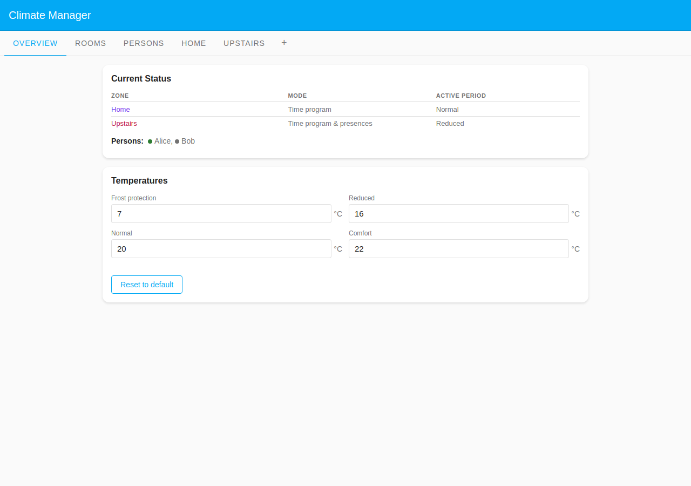
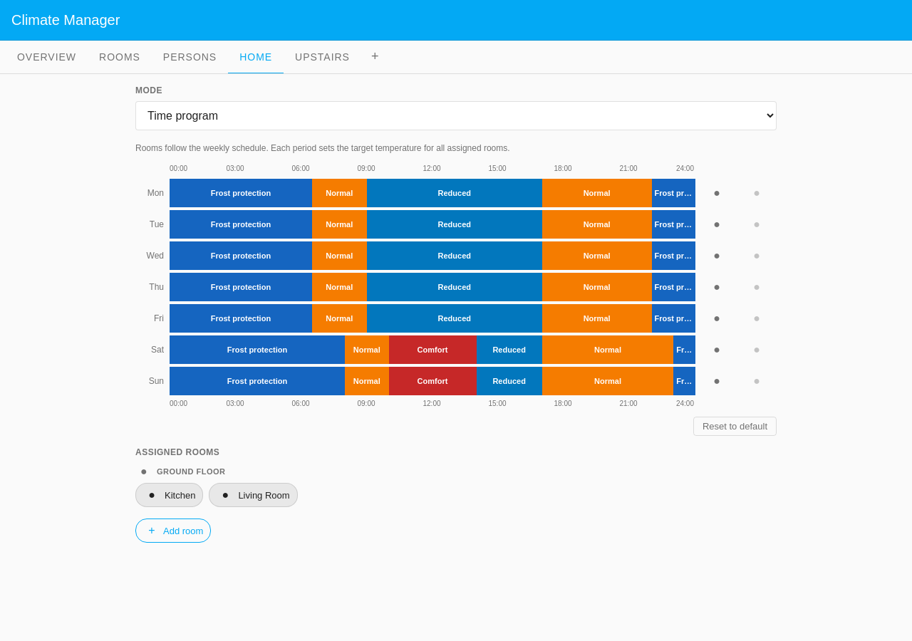
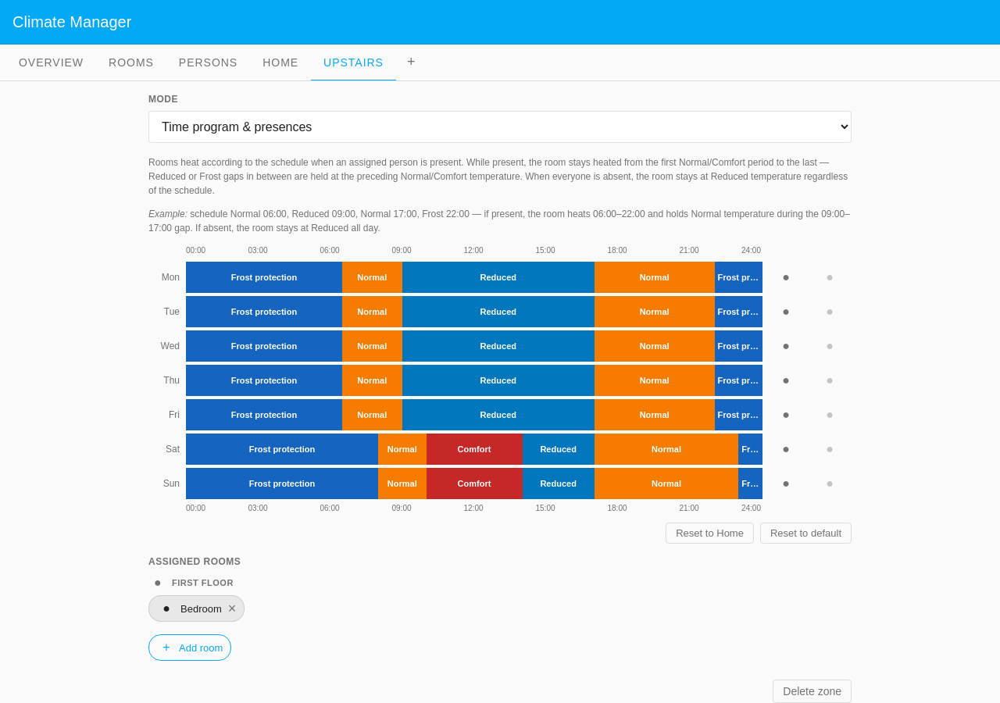
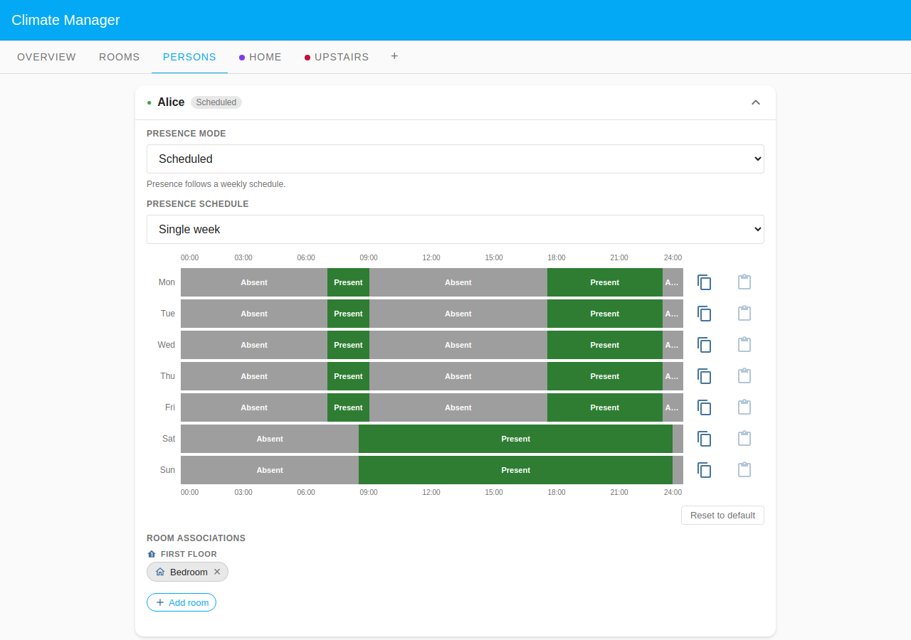
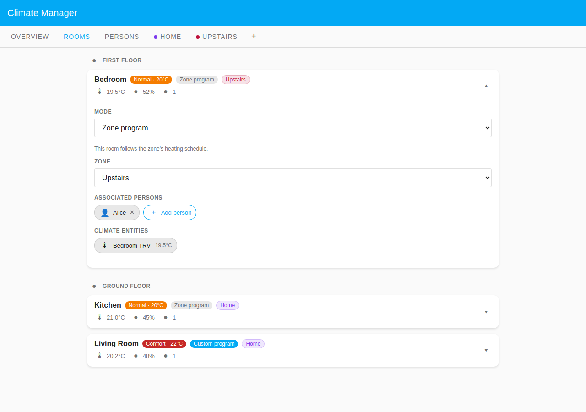

# Climate Manager

A Home Assistant custom integration that manages home climate controls through
smart radiator thermostats (TRVs). It provides zone-based heating modes, weekday
time programs, per-room zone assignment, and person presence tracking, all
configurable through a full Lovelace dashboard panel.

> **Core value:** Every room is always at the right temperature at the right
> time, without manual intervention, driven by schedules and who is actually
> home. Everything is configured from the dashboard panel: no YAML editing, no
> blueprints.

---

## Table of Contents

- [Prerequisites](#prerequisites)
- [Features](#features)
- [Installation](#installation)
- [How it works](#how-it-works)
- [Configuration](#configuration)
- [Use cases](#use-cases)
- [Comparison with similar integrations](#comparison-with-similar-integrations)
- [Requirements](#requirements)
- [Development](#development)
- [License](#license)

---

## Prerequisites

### Home Assistant Areas with Climate Entities and Temperature Sensors

Climate Manager discovers rooms automatically from the HA **Area registry**. For
a room to appear in the panel, two conditions must be met:

1. **At least one `climate` entity** (TRV / thermostat) must be assigned to the
   area, either directly on the entity, or via the device it belongs to.
2. **A temperature sensor** in the same area is strongly recommended. Without
   one, calibration is disabled and the Overview tab cannot show live room
   temperatures. Climate Manager auto-discovers the first `sensor` entity with
   `device_class: temperature` in the area; you can also override this manually
   in each room's settings.

**How to set up an area in Home Assistant:**

1. Go to **Settings → Areas & Zones** and create an area for each physical room
   (e.g. "Living Room", "Bedroom").
2. Open each TRV device (**Settings → Devices & Services → Devices**), find the
   target device, and assign it to the matching area.
3. Open each temperature sensor device and assign it to the same area. If the
   sensor is a standalone entity without a device, set its area directly via
   **Settings → Devices & Services → Entities**.
4. After assigning all devices, restart Home Assistant (or reload the
   integration), Climate Manager picks up area assignments automatically.

> **Tip:** Room names shown in the panel are the HA area names. Rename areas in
> **Settings → Areas & Zones** to control what appears in the panel.

---

## Features



- **Zone-based scheduling**: Group rooms into zones, each with its own weekly
  heating program (Normal, Comfort, Reduced, Frost Protection periods)
- **Three heating modes per zone**: _Off_, _Time program_, _Time program &
  presences_
- **Per-room zone assignment**: Assign each room to a zone; the room follows
  that zone's program. Move a room to an _Off_ zone to keep it at frost
  protection
- **Person presence**: Associate persons with rooms; in _Time program &
  presences_ mode the room only heats when someone is home
- **Presence tracking modes**: Scheduled (weekly timetable), HA home tracking,
  Force Present, Force Absent
- **Gap-fill logic**: When a person is present, Reduced/Frost periods sandwiched
  between Normal/Comfort periods are held at the preceding Normal/Comfort
  temperature
- **Live status**: Overview tab shows current period, temperature, and humidity
  for every room
- **TRV calibration**: Optional auto-calibration of TRV offsets toward a room
  temperature sensor (Tado X supported)
- **TRV control**: Works with any HA `climate` entity; no brand-specific APIs

---

## Installation

### HACS (recommended)

1. Open HACS → Integrations → ⋮ → Custom repositories
2. Add `https://github.com/ArnaudD-FR/climate-manager` as an Integration
3. Search for **Climate Manager** and install
4. Restart Home Assistant
5. Go to Settings → Integrations → Add Integration → **Climate Manager**

### Manual

Two methods are available depending on whether you have SSH access to your HA
host.

#### Method 1: File copy (no SSH required)

1. Download or clone this repository
2. Copy `custom_components/climate_manager/` into your HA
   `config/custom_components/` directory
3. Restart Home Assistant
4. Go to Settings → Integrations → Add Integration → **Climate Manager**

#### Method 2: `make deploy` (requires SSH access)

Builds the frontend and deploys everything over SSH in one command.

1. Clone this repository and install dependencies:

   ```bash
   uv sync
   cd frontend && npm install
   ```

2. Optionally create `Makefile.local` to override the HA host or user:

   ```make
   HA_HOST = your-ha-hostname.local
   HA_USER = root
   ```

3. Deploy:

   ```bash
   make deploy
   ```

   This builds the frontend bundle, copies all integration files to your HA
   instance via SCP, and restarts HA core automatically.

---

## How it works

### Zones and modes

Rooms are grouped into **zones**. Each zone has a **mode**:

| Mode                         | Behaviour                                                         |
| ---------------------------- | ----------------------------------------------------------------- |
| **Off**                      | All rooms in the zone are kept at frost protection temperature    |
| **Time program**             | Rooms follow the zone's weekly schedule                           |
| **Time program & presences** | Rooms follow the schedule only when an assigned person is present |



### Time program

A weekly schedule divided into days (Mon–Sun). Each day has periods with a start
time and a mode:

| Period               | Typical use                                           |
| -------------------- | ----------------------------------------------------- |
| **Normal**           | Standard daytime temperature                          |
| **Comfort**          | Higher temperature (e.g. weekends, working from home) |
| **Reduced**          | Lower temperature (sleeping, away)                    |
| **Frost Protection** | Minimum anti-freeze temperature                       |

Each period is active from its start time until the next period's start. The
last period of the day runs until midnight.



### Presence & scheduling

When a zone is in _Time program & presences_ mode:

- **Person absent** → room stays at Reduced temperature regardless of the
  schedule
- **Person present** → room is heated from the first Normal/Comfort period to
  the last
- **Gap-fill**: A Reduced or Frost period sandwiched between two Normal/Comfort
  periods is held at the preceding Normal/Comfort temperature while someone is
  present

**Example:** schedule Normal 06:00 → Reduced 09:00 → Normal 17:00 → Frost 22:00.
If present all day: room heats 06:00–22:00, holding Normal during the
09:00–17:00 Reduced gap. If absent: room stays at Reduced all day.



### Rooms and zones

Rooms do not carry their own schedule: each room belongs to a **zone** and
follows that zone's program and mode. A room is in the **Default Zone** unless
you assign it to a custom zone.

| Per-room setting       | Effect                                                         |
| ---------------------- | -------------------------------------------------------------- |
| **Zone**               | Which zone the room belongs to (Default Zone or a custom zone) |
| **Associated persons** | Whose presence heats the room in _Time program & presences_    |
| **Pre-heat lead**      | Max minutes the room may start heating early before an arrival |

To turn a room off, assign it to a zone whose mode is **Off** (or create a
dedicated Off zone for it).



---

## Configuration

All configuration is done through the panel UI accessible from the HA sidebar.
No YAML editing required.

### Global settings


- Period temperatures (Normal, Comfort, Reduced, Frost Protection)
- Default zone name
- TRV auto-calibration (enable/disable; Tado X offset calibration)

### Zones

- Create and name zones
- Set zone mode (Off / Time program / Time program & presences)
- Edit the weekly time program
- Assign rooms to zones

### Rooms

- Assign the room to a zone (Default Zone or a custom zone)
- Assign persons to a room
- Set the pre-heat lead time

### Persons

- Set presence mode (Scheduled / HA home tracking / Force Present / Force
  Absent)
- Edit presence schedule
- Assign rooms

---

## Use cases

Worked examples under [`docs/use-cases/`](docs/use-cases/) show how to configure
the panel for real households. Each folder is a self-contained showcase with a
README, annotated screenshots (Overview, Rooms, Persons), and a mock harness
that regenerates its screenshots via `make screenshots`.

| Use case                                                                         | What it demonstrates                                                                                                       |
| -------------------------------------------------------------------------------- | -------------------------------------------------------------------------------------------------------------------------- |
| [Simple schedule](docs/use-cases/simple-schedule/)                               | A single-week presence schedule for a standard office routine                                                              |
| [Business calendar](docs/use-cases/business-calendar/)                           | Calendar presence mode driven by a work calendar, plus a custom Office zone                                                |
| [Student mixed schedule](docs/use-cases/student-mixed-schedule/)                 | A single-week schedule with different class times each weekday                                                             |
| [Rotating shift worker](docs/use-cases/rotating-shift-worker/)                   | HA home tracking presence for irregular shifts, across two zones                                                           |
| [Shared custody (odd/even weeks)](docs/use-cases/shared-custody-odd-even-weeks/) | Even / Odd weeks combining a Pronote school calendar on weekdays with a manual weekend schedule and a Friday-noon handover |
| [Predictive pre-heat](docs/use-cases/predictive-preheat/)                        | Pre-heating rooms so they are warm before the first event of the day, with a per-room lead time                            |
| [Bathroom comfort zone](docs/use-cases/bathroom-comfort-zone/)                   | A custom Bathrooms zone running its own comfort-led program separate from the rest of the home                             |

---

## Comparison with similar integrations

Climate Manager covers the full loop from scheduling and presence to TRV control
in one cohesive system. The table below positions it against the most common
alternatives.

| Feature                                  | Climate Manager                       | [Better Thermostat][bt] | [Versatile Thermostat][vt] | [Generic Thermostat][gt] | [Schedy][sc]      |
| ---------------------------------------- | ------------------------------------- | ----------------------- | -------------------------- | ------------------------ | ----------------- |
| Zone-based weekly time programs          | Yes                                   | No                      | No                         | No                       | Custom rules      |
| Per-room zone assignment                 | Yes                                   | No                      | No                         | No                       | No                |
| Person presence tracking                 | Scheduled, HA home tracking, calendar | No                      | Via plugins                | No                       | Via rules         |
| Calendar presence (HA `calendar.*`)      | Yes                                   | No                      | No                         | No                       | No                |
| Even/odd week schedules                  | Yes                                   | No                      | No                         | No                       | No                |
| Predictive pre-heat with learned inertia | Yes                                   | No                      | No                         | No                       | No                |
| TRV temperature offset auto-calibration  | Yes                                   | Yes (MPC/PID/TPI)       | Yes (TPI)                  | No                       | No                |
| Dedicated dashboard (no YAML)            | Yes                                   | No (YAML + automations) | Partial                    | No (YAML)                | No (YAML)         |
| Works with any `climate` entity          | Yes                                   | Specific TRV models     | Yes                        | No (switches only)       | Yes               |
| Installation                             | HACS / manual                         | HACS                    | HACS                       | Built-in HA              | AppDaemon package |

**[Better Thermostat][bt]** focuses on per-TRV calibration algorithms (MPC, PID,
TPI) and fixing the imprecise temperature readings common on radiator-mounted
sensors. It has no scheduling engine of its own: time programs and presence
logic must be added through separate automations.

**[Versatile Thermostat][vt]** is a feature-rich per-room virtual thermostat
with TPI control, motion and window detection, and preset management. Each
instance controls one room independently. Multi-room coordination and zone-level
scheduling require additional configuration outside the integration.

**[Generic Thermostat][gt]** is the built-in HA baseline: a simple on/off
controller for a switch-backed heater. No TRV support, no scheduling, no
presence. It is the starting point many users outgrow.

**[Schedy][sc]** (hass-apps) is a general-purpose scheduler that can drive any
actor, including climate entities. It is highly flexible through inline Python
rules but requires AppDaemon, YAML configuration, and manual rule authoring for
every room and condition.

[bt]: https://github.com/KartoffelToby/better_thermostat
[vt]: https://github.com/jmcollin78/versatile_thermostat
[gt]: https://www.home-assistant.io/integrations/generic_thermostat/
[sc]: https://hass-apps.readthedocs.io/en/stable/apps/schedy/

---

## Requirements

- Home Assistant 2025.x or later
- Smart thermostat(s) exposed as HA `climate` entities
- Python 3.12+

---

## Development

```bash
# Install dependencies
uv sync

# Run tests
make test

# Build frontend
make build

# Deploy to HA instance (requires SSH access)
make deploy

# Regenerate README screenshots (requires Docker)
make screenshots
```

Frontend stack: Lit 3.x · TypeScript 5.x · Vite 5.x

---

## License

[MIT](LICENSE)
