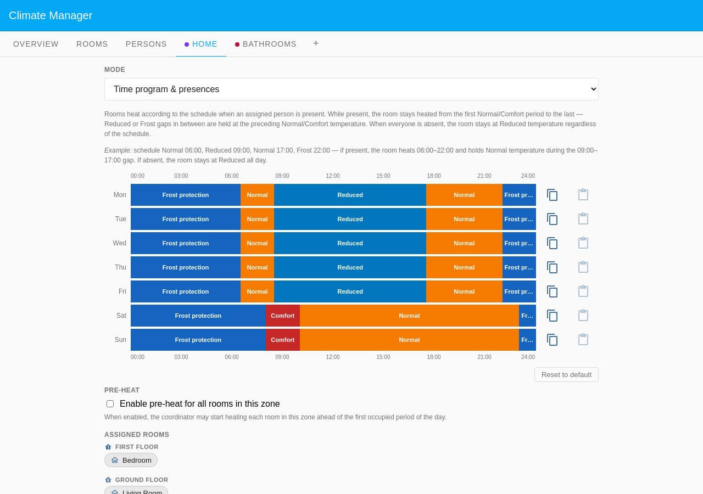
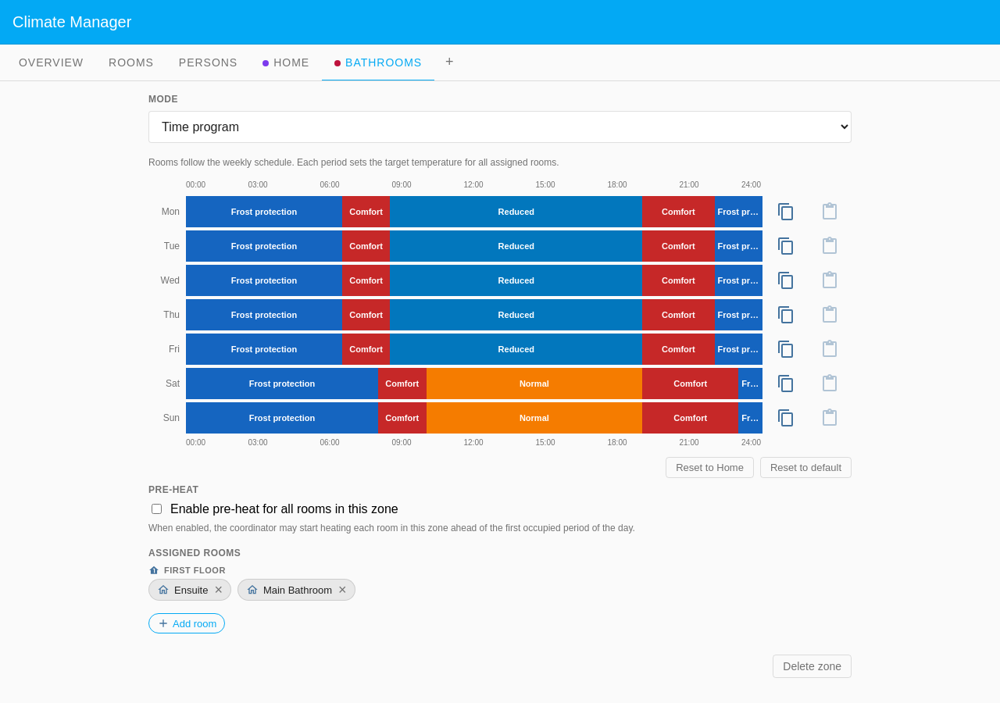
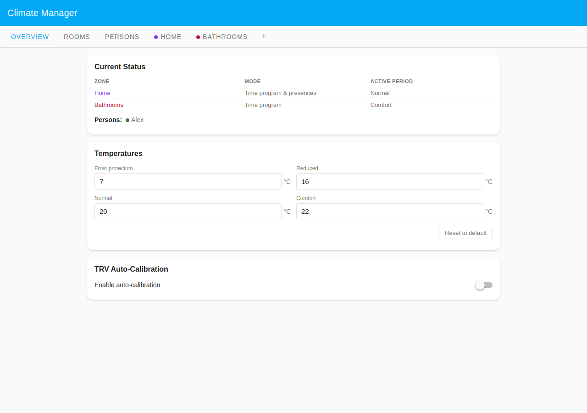
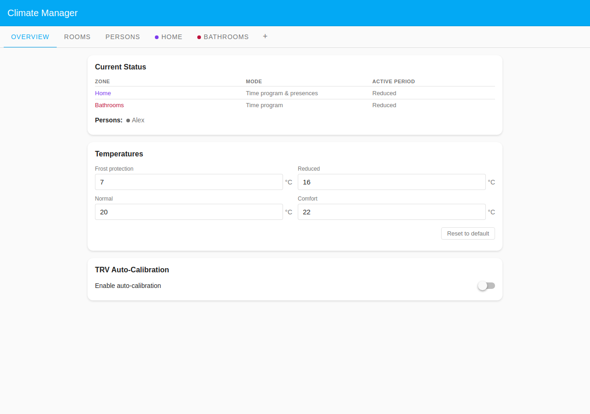
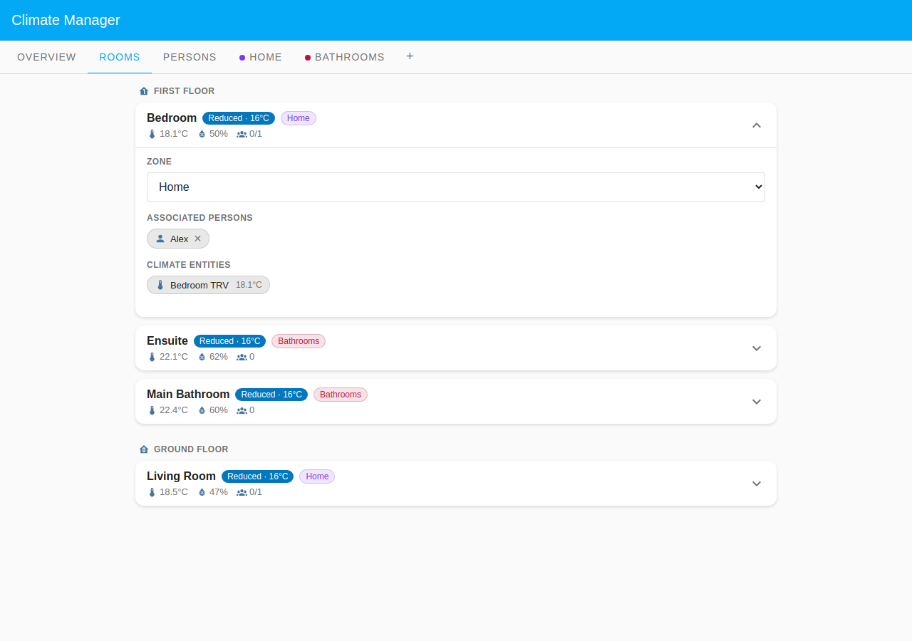

# Bathrooms Comfort Zone

Bathrooms want a different heating rhythm from the rest of the house: warm for
the morning and evening wash, cooler in between, and never left cold overnight.
This example groups the two bathrooms into their own custom **Bathrooms** zone
in **Time program** mode, so they heat on schedule regardless of who is home.
The living areas follow the **Home** Default Zone in **Time program &
presences** mode, where Alex's presence decides whether they heat. The two
states below put those two zone modes side by side: as Alex comes and goes, the
Home zone tracks him while the Bathrooms zone tracks only the clock.

## Table of Contents

- [Configuration](#configuration)
  - [Household layout](#household-layout)
  - [Zone modes compared](#zone-modes-compared)
  - [Presence configuration](#presence-configuration)
  - [Zone schedules](#zone-schedules)
- [What happens](#what-happens)

## Configuration

### Household layout

| Room          | Zone                    | Floor        | Heats when                      |
| ------------- | ----------------------- | ------------ | ------------------------------- |
| Main Bathroom | Bathrooms (custom zone) | First Floor  | Comfort-led schedule, always    |
| Ensuite       | Bathrooms (custom zone) | First Floor  | Comfort-led schedule, always    |
| Living Room   | Home (Default Zone)     | Ground Floor | Domestic schedule, Alex present |
| Bedroom       | Home (Default Zone)     | First Floor  | Domestic schedule, Alex present |

### Zone modes compared

| Zone        | Mode                     | Person needed | Heats when                        |
| ----------- | ------------------------ | ------------- | --------------------------------- |
| Bathrooms   | Time program             | No            | Schedule runs at all times        |
| Home (Def.) | Time program & presences | Yes (Alex)    | Schedule runs only when Alex home |

A **Time program** zone ignores presence entirely. A **Time program &
presences** zone applies its schedule only when at least one assigned person is
present; otherwise the room sets back to Reduced. The two bathrooms need no
assigned person; the living areas need Alex assigned.

### Presence configuration

Alex uses **Scheduled** presence mode (single week), assigned to **Bedroom** and
**Living Room** only.

Alex's card shows a **Single week** schedule: present overnight and in the
evening, absent 08:30–18:00 on weekdays, present all weekend. Room associations
list Bedroom (First Floor) and Living Room (Ground Floor); the bathrooms are
deliberately absent from his list.

### Zone schedules

The **Home** zone heats Normal 06:30–08:30 and 17:30–22:00 on weekdays, Comfort
then Normal 08:00–23:00 at weekends.

The **Bathrooms** zone is Comfort at wake-up (06:30–08:30), Reduced through the
weekday, then Comfort again from 19:00; weekends run Comfort, Normal, then
Comfort from 19:00. It reaches Comfort on schedule with nobody assigned.

## What happens

The focus here is the **Home** zone, which is the presence-gated one. The
Bathrooms zone is shown alongside to make the point that it does not react to
Alex at all.

### When Alex is home (Wednesday 20:00)

It is the evening wash hour. Alex is home, so the Home zone follows its evening
Normal period, and the Bathrooms zone is in its 19:00 Comfort period.

The Overview shows Home at **Normal** and Bathrooms at **Comfort**, with Alex
present (green dot).

Bedroom and Living Room show **Normal · 20°C** with **1/1** present; Ensuite and
Main Bathroom show **Comfort · 22°C** with **0** persons (Comfort runs without
anyone assigned). The expanded Bedroom card shows Alex associated, TRV at
19.4°C.

### When Alex is at work (Wednesday 12:00)

Alex is out, so the Home zone presence gate closes and its rooms set back to
**Reduced**. The Bathrooms zone is **Reduced** too, but only because its own
midday schedule says so (Reduced 08:30–19:00), not because Alex is away.

The Overview shows Alex absent (grey dot). Both zones read **Reduced**, for two
different reasons: Home because nobody is home, Bathrooms because that is its
schedule at midday.

All four rooms show **Reduced · 16°C**. The Home rooms are **0/1** present and
gated off; the bathrooms carry no person count and would read exactly the same
whether Alex were home or not. Come 19:00 the bathrooms return to Comfort on
their own, with or without him.
