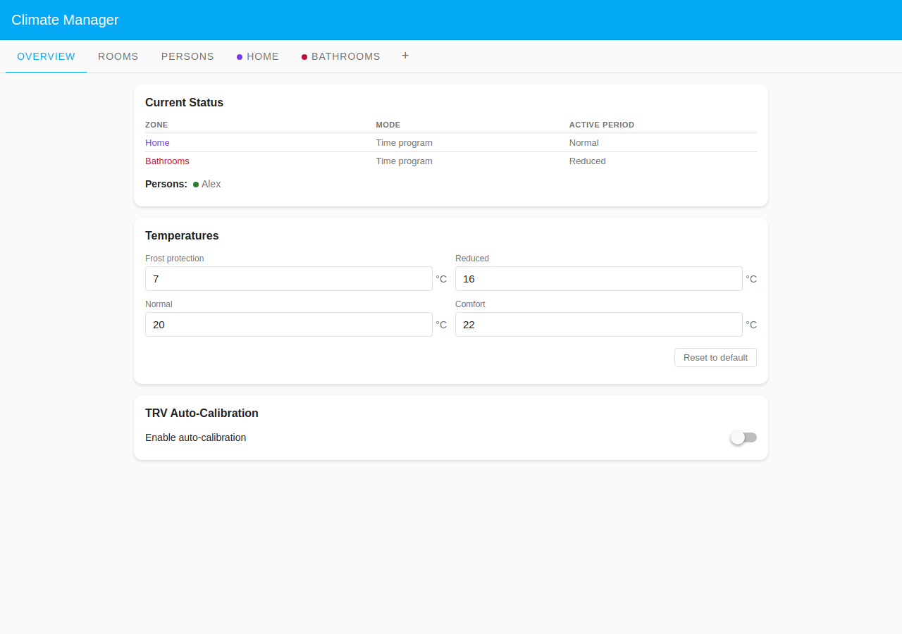
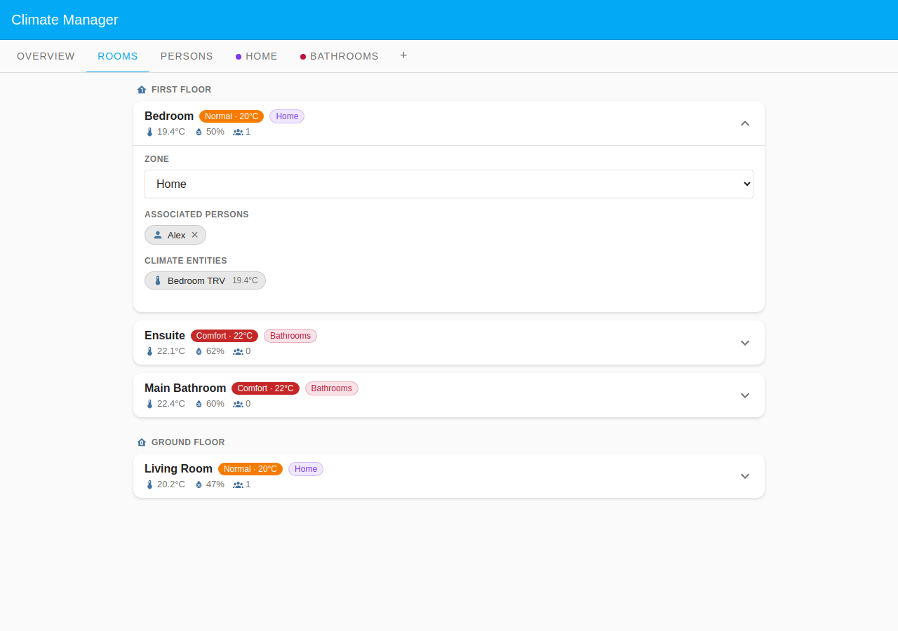
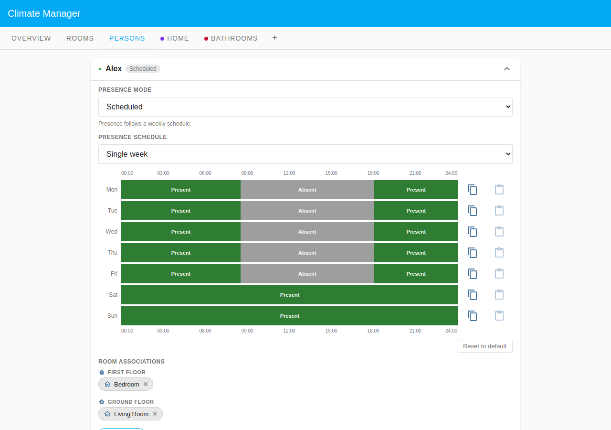

# Bathrooms Comfort Zone

Bathrooms want a different heating rhythm from the rest of the house: warm for
the morning and evening wash, cooler in between, and never left cold overnight.
This example groups the two bathrooms into their own **custom zone** with a
comfort-led program, while the rest of the home follows an ordinary day/night
schedule. It showcases how zones let one part of the house run a completely
different program from the default.

## Household layout

| Room          | Zone                    | Floor        | Program                 |
| ------------- | ----------------------- | ------------ | ----------------------- |
| Main Bathroom | Bathrooms (custom zone) | First Floor  | Comfort-led (see below) |
| Ensuite       | Bathrooms (custom zone) | First Floor  | Comfort-led (see below) |
| Living Room   | Home (Default Zone)     | Ground Floor | Normal day/night        |
| Bedroom       | Home (Default Zone)     | First Floor  | Normal day/night        |

Both bathrooms are assigned to the **Bathrooms** zone via `zone_id`; the living
room and bedroom stay in the Default Zone. Zones share one weekly program, so
adding a third bathroom is just another `zone_id` assignment.

## Zone programs compared

The two zones run side by side with different period schedules:

### Bathrooms zone — weekdays (Mon–Fri)

| From  | Period                |
| ----- | --------------------- |
| 00:00 | Frost protection      |
| 06:30 | **Comfort** (wake-up) |
| 08:30 | **Reduced** (daytime) |
| 19:00 | **Comfort** (evening) |
| 22:00 | Frost protection      |

### Bathrooms zone — weekend (Sat–Sun)

| From  | Period                      |
| ----- | --------------------------- |
| 00:00 | Frost protection            |
| 08:00 | **Comfort** (later wake-up) |
| 10:00 | **Normal** (daytime)        |
| 19:00 | **Comfort** (evening)       |
| 23:00 | Frost protection            |

So the bathrooms are at comfort for the morning and evening wash, reduced during
the working day (normal at weekends), and never warmer than needed overnight —
while the **Home** zone keeps the living areas on its usual normal/comfort
day-night cycle.

## Occupant

A single occupant, **Alex** (`mode: 'scheduled'`), keeps the Persons tab
populated. The bathrooms heat purely from their zone program — they do not
depend on anyone's presence — which is exactly why a dedicated zone, rather than
person-driven presence, is the right tool here.

## Screenshots

### Overview tab

The Overview lists both zones — **Home** in its normal evening period and
**Bathrooms** showing its **comfort** active period.

### Rooms tab

The expanded Main Bathroom card carries the **Bathrooms** zone badge and its
comfort-period temperature, distinct from the Living Room and Bedroom which sit
in the Default Zone.

### Persons tab — Alex card expanded

Alex's card shows a simple single-week schedule with Bedroom and Living Room
chips — confirming the bathrooms' comfort schedule is driven by the zone, not by
presence.
