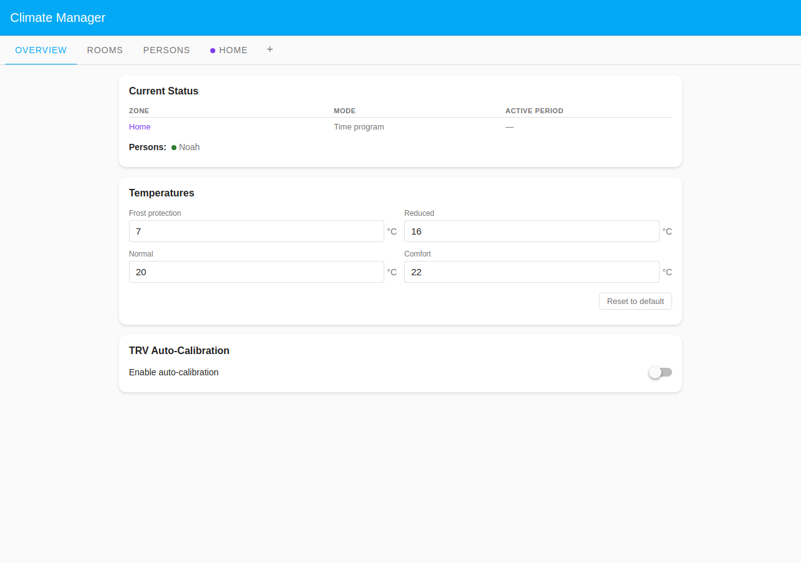
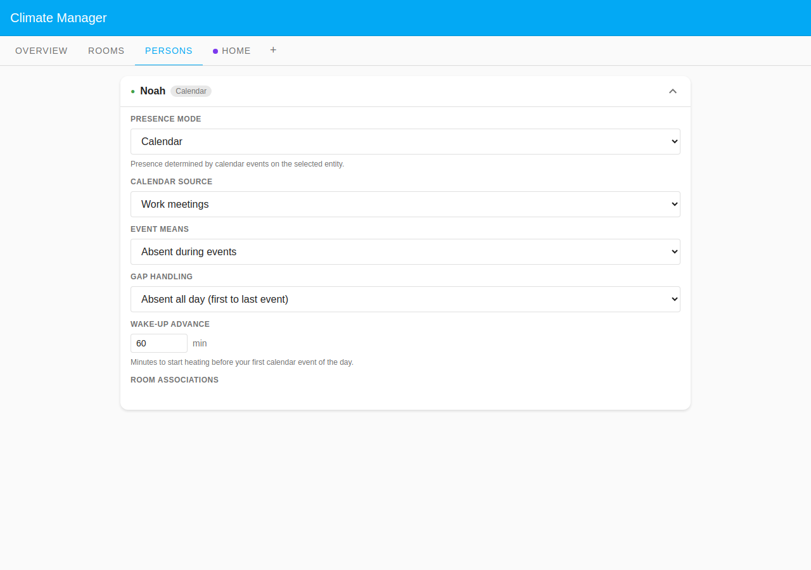
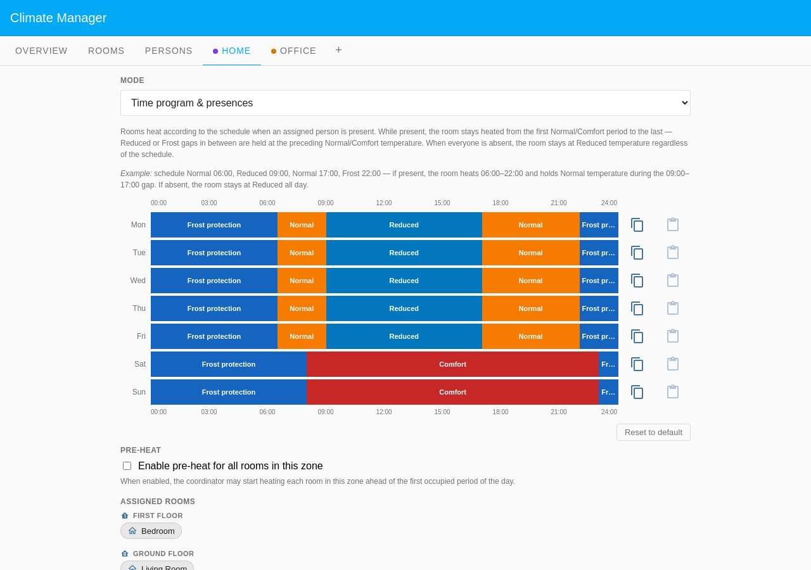
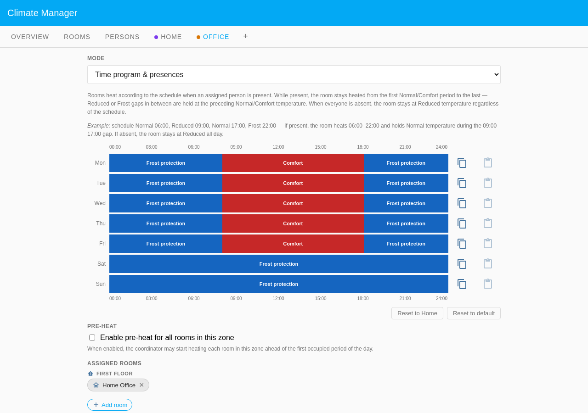

# Noah — Business Calendar

Noah works from a dedicated home office and attends meetings or travels
frequently. Rather than encoding a fixed schedule he delegates his presence
entirely to a calendar: whenever the **Work Meetings** calendar has an active
event, he is treated as away. This scenario showcases the **Calendar** presence
mode and two-zone layout — the Home Office sits in its own **Office** zone with
a work-hours heating programme, while the Bedroom and Living Room follow the
**Home** Default Zone domestic programme. **Both zones are Time program &
presences** — the same calendar drives presence for all three rooms. When a
meeting or travel event is active Noah counts as away and every room sets back
to Reduced; when the calendar is clear he is present and both zones' schedules
apply normally.

The screenshots are pinned to **Wednesday at 10:30** — no meeting is active (the
only event is an afternoon "Team sync" at 14:00), so Noah is present and all
three rooms are heating to their scheduled periods.

## Household layout

| Room        | Zone        | Floor        | Heats when                        |
| ----------- | ----------- | ------------ | --------------------------------- |
| Home Office | Office      | First Floor  | Work-hours comfort — Noah present |
| Bedroom     | Home (Def.) | First Floor  | Domestic programme — Noah present |
| Living Room | Home (Def.) | Ground Floor | Domestic programme — Noah present |

## Zone configuration

| Zone        | Mode                     | Programme                                 |
| ----------- | ------------------------ | ----------------------------------------- |
| Home (Def.) | Time program & presences | Domestic day/night (normal/frost)         |
| Office      | Time program & presences | Work-hours comfort (08:00–18:00 weekdays) |

Both zones are presence-driven. A room in either zone only heats to its
scheduled period when Noah is present (calendar shows no active event). When an
event is active all his rooms set back to Reduced regardless of which zone they
are in.

## Presence configuration

Noah uses **Calendar** presence mode.

| Setting         | Value                                |
| --------------- | ------------------------------------ |
| Calendar source | Work Meetings                        |
| Event means     | Absent during events                 |
| Gap handling    | Absent all day (first to last event) |
| Wake-up advance | 30 minutes                           |

The **Wake-up advance** of 30 minutes shifts Noah's calendar-derived presence to
begin 30 minutes before the **first calendar event of the day** so his rooms are
warm before his first meeting — not a return-home mechanism.

No schedule time-bar editor is shown for Calendar-mode persons; the panel
instead renders the calendar configuration selectors (Calendar source picker,
**Event means** selector, **Gap handling** selector, and **Wake-up advance**
field).

## Rooms driven by Noah

Noah has **Home Office**, **Bedroom**, and **Living Room** in his **Room
associations**. All three rooms need an assigned person because both zones are
**Time program & presences** — a room with no assigned person in a presences
zone would never heat to its scheduled period.

| Room        | Zone   | Tracked for presence |
| ----------- | ------ | -------------------- |
| Home Office | Office | yes                  |
| Bedroom     | Home   | yes                  |
| Living Room | Home   | yes                  |

When the calendar shows no active event Noah is present and all three rooms show
a person count of 1/1 and heat according to their zone schedule.

## Screenshots

### Overview

The Overview tab shows two zone rows — Home (Time program & presences, active
period **Normal**) and Office (Time program & presences, active period
**Comfort**) — with Noah listed as currently present (green dot).

### Rooms

The Rooms tab groups all three rooms by floor on the First Floor: Bedroom
(**Normal · 20°C**, Home badge) and Home Office (**Comfort · 22°C**, Office
badge). Living Room (**Normal · 20°C**, Home badge) appears on the Ground Floor.
Each room shows a 1/1 person count because Noah is present.

### Persons

The expanded Noah card shows the calendar configuration: Calendar source (Work
Meetings), Event means (**Absent during events**), Gap handling (**Absent all
day (first to last event)**), and **Wake-up advance** (30 min). Room
associations appear below, grouped by floor: Bedroom and Home Office on the
First Floor, Living Room on the Ground Floor.

### Zone schedules

Both zones run in **Time program & presences** mode, so the weekly schedule is
the gate: presence only decides whether the schedule is followed — it can never
heat a zone outside its scheduled Normal/Comfort window.

The **Home** zone heats Normal 06:30–09:00, eases to Reduced through the work
day, returns to Normal 17:00–22:00 on weekdays, and holds Comfort 08:00–23:00 at
weekends; Frost protection fills the rest.

The **Office** zone is Comfort only 08:00–18:00 on weekdays and Frost protection
all weekend. Even when Noah works from home, the office cannot warm before 08:00
or after 18:00 — the schedule, not his presence, draws that boundary.
