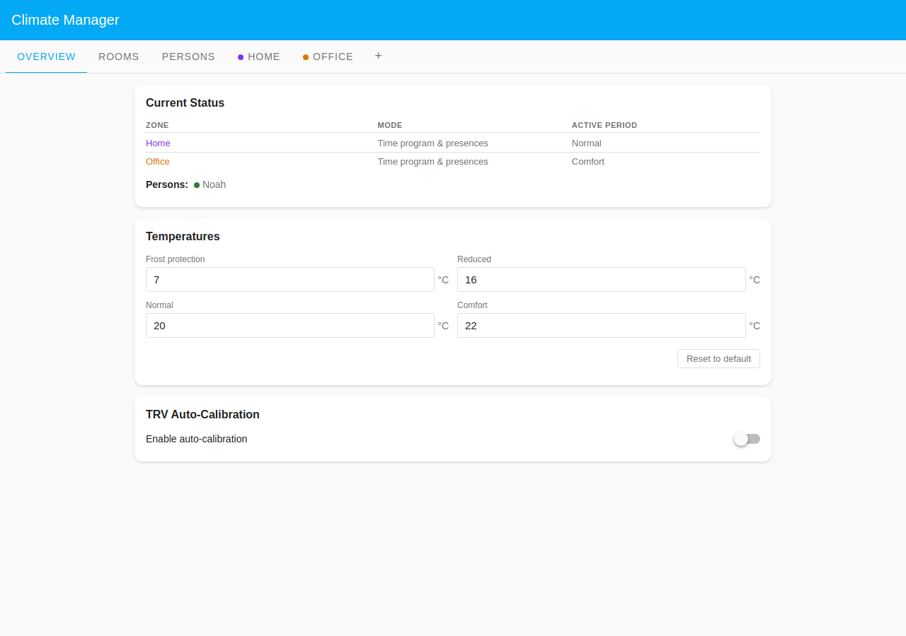
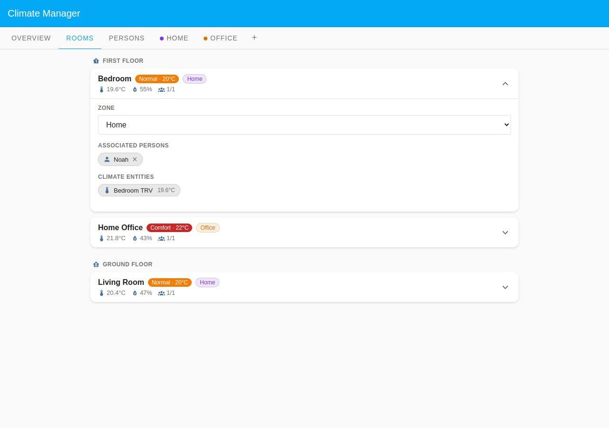

# Noah: Business Calendar

Noah works from a dedicated home office and attends meetings or travels
frequently. Rather than encoding a fixed schedule he delegates his presence
entirely to a calendar: whenever the **Work Meetings** calendar has an active
event, he is treated as away. This scenario showcases the **Calendar** presence
mode and a two-zone layout. The Home Office sits in its own **Office** zone with
a work-hours heating programme, while the Bedroom and Living Room follow the
**Home** Default Zone domestic programme.

Both zones are **Time program & presences**, so the same calendar gates all
three rooms: when a meeting is active Noah counts as away and every room sets
back to Reduced; when the calendar is clear he is present and both zones'
schedules apply. The two states below show that contrast around his one "Team
sync" meeting (14:00–15:00).

## Table of Contents

- [Configuration](#configuration)
  - [Household layout](#household-layout)
  - [Presence configuration](#presence-configuration)
  - [Zone schedules](#zone-schedules)
- [What happens](#what-happens)

## Configuration

### Household layout

| Room        | Zone        | Floor        | Heats when                       |
| ----------- | ----------- | ------------ | -------------------------------- |
| Home Office | Office      | First Floor  | Work-hours comfort, Noah present |
| Bedroom     | Home (Def.) | First Floor  | Domestic programme, Noah present |
| Living Room | Home (Def.) | Ground Floor | Domestic programme, Noah present |

Both zones are presence-driven. Noah has all three rooms in his **Room
associations**; each needs an assigned person because a room with nobody
assigned in a presences zone never leaves Reduced.

### Presence configuration

Noah uses **Calendar** presence mode: no schedule time-bar, just the calendar
selectors.

| Setting         | Value                                |
| --------------- | ------------------------------------ |
| Calendar source | Work Meetings                        |
| Event means     | Absent during events                 |
| Gap handling    | Absent all day (first to last event) |
| Wake-up advance | 30 minutes                           |

The **Wake-up advance** of 30 minutes shifts Noah's calendar-derived presence to
begin 30 minutes before the **first calendar event of the day**, so his rooms
are warm before his first meeting. It is not a return-home mechanism.

The expanded Noah card shows the calendar configuration: Calendar source (Work
Meetings), Event means (**Absent during events**), Gap handling (**Absent all
day (first to last event)**), and **Wake-up advance** (30 min). Room
associations appear below, grouped by floor.

### Zone schedules

Both zones run in **Time program & presences** mode, so the weekly schedule is
the gate: presence only decides whether the schedule is followed. It can never
heat a zone outside its scheduled Normal/Comfort window.

The **Home** zone heats Normal 06:30–09:00, eases to Reduced through the work
day, returns to Normal 17:00–22:00 on weekdays, and holds Comfort 08:00–23:00 at
weekends; Frost protection fills the rest.

The **Office** zone is Comfort only 08:00–18:00 on weekdays and Frost protection
all weekend.

## What happens

### When no meeting is active (Wednesday 10:30)

The calendar is clear, so Noah counts as working from home and the presence gate
is open for both zones.

The Overview shows two zone rows (Home at **Normal**, Office at **Comfort**)
with Noah present (green dot).

Home Office shows **Comfort · 22°C** (Office badge); Bedroom and Living Room
show **Normal · 20°C** (Home badge). Each room is **1/1** present.

### When a meeting is active (Wednesday 14:30)

Noah is in the "Team sync" meeting (14:00–15:00), so the Calendar marks him away
and the presence gate closes for every room, regardless of which zone it is in.

The Overview now shows Noah absent (grey dot) and both zones fell back to
**Reduced**.

All three rooms, including the Office, show **Reduced · 16°C** and **0/1**
present. The Office's own Comfort schedule is still in its 08:00–18:00 window,
but presence overrides it: an empty office is not heated to Comfort.
