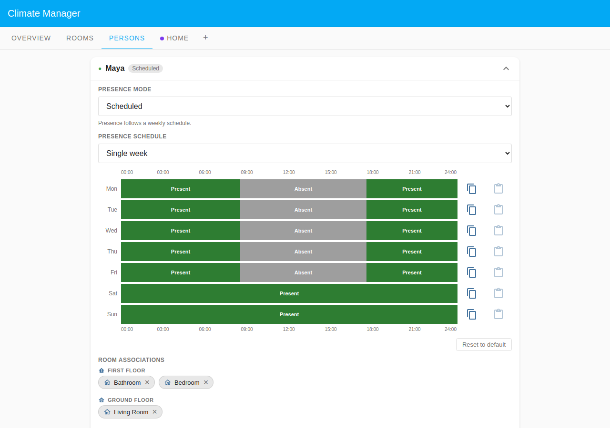
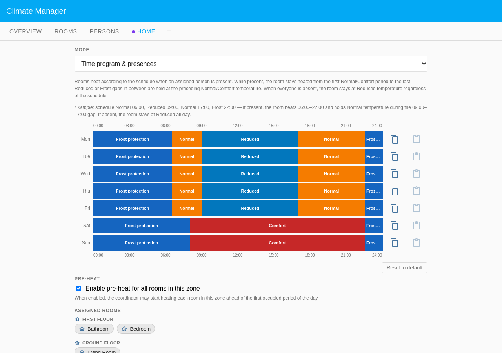
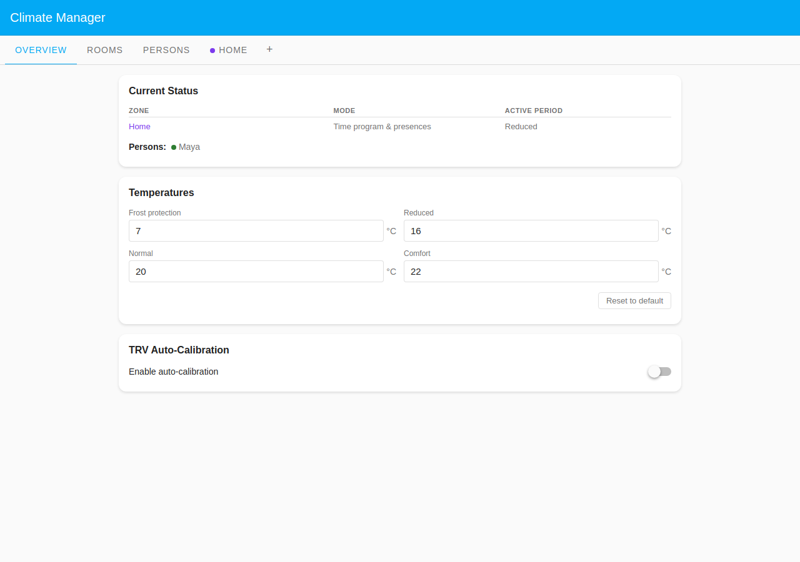
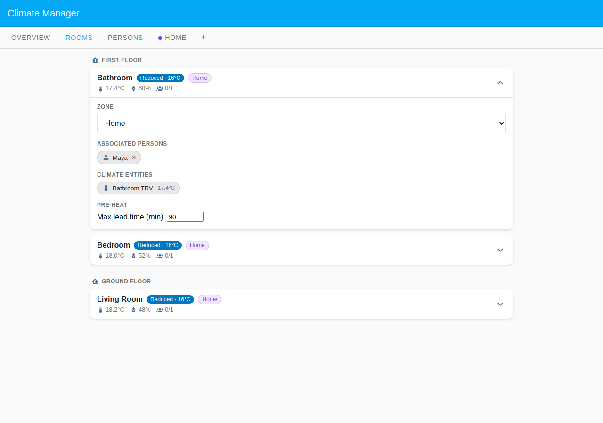

# Maya: Predictive Pre-heat

Maya wants her bedroom and bathroom to be warm when she wakes up, not to _start_
heating when she gets out of bed. With **Pre-heat** enabled on the Home zone,
the coordinator looks ahead to the 06:30 Normal period and begins heating early,
using each room's allowed lead time, so the rooms reach target right as the
morning period begins.

Pre-heat still rides on the presence gate: it only runs for a room whose
assigned person is present. The two states below show that: Maya home asleep
(pre-heat warming the house ahead of the step) versus Maya out (no pre-heat, the
rooms held at Reduced).

## Configuration

### Household layout

| Room        | Zone                | Floor        | Heats when                           |
| ----------- | ------------------- | ------------ | ------------------------------------ |
| Bedroom     | Home (Default Zone) | First Floor  | Time program + pre-heat before 06:30 |
| Bathroom    | Home (Default Zone) | First Floor  | Time program + pre-heat before 06:30 |
| Living Room | Home (Default Zone) | Ground Floor | Time program + pre-heat before 06:30 |

The Default Zone **Home** uses **Time program & presences** and has **Pre-heat**
enabled. All three rooms have Maya in their **Room associations**, so all three
are eligible for pre-heat. A room with nobody assigned would be set back, not
pre-heated.

### Presence configuration

Maya uses **Scheduled** presence mode (single week).

| Day       | Present                              | Away          |
| --------- | ------------------------------------ | ------------- |
| Mon–Fri   | Overnight, before 08:30, after 17:30 | 08:30 – 17:30 |
| Sat / Sun | All day                              | none          |

Asleep at home overnight is **present**; absence is only for the hours Maya is
actually out of the house.

Maya's card shows her **Single week** schedule with present overnight and absent
08:30–17:30 on weekdays. Room associations list Bathroom and Bedroom (First
Floor) and Living Room (Ground Floor).

Pre-heat tuning lives on the room cards, not the person:

- **Max lead time (min)** per room (Bedroom 60, Bathroom 90): the maximum
  head-start the coordinator may take. Living Room has no explicit cap, so the
  zone default applies.
- Pre-heat is driven by the zone **Pre-heat** toggle and each room's **Max lead
  time (min)**. The **Wake-up advance** field is Calendar-only and unused here.

### Home zone schedule

The single **Home** zone runs in **Time program & presences** mode with
**Pre-heat** enabled. The schedule still bounds heating; pre-heat only brings
the _start_ of a scheduled period forward.

Weekdays heat Normal 06:30–09:00, Reduced midday, Normal 17:00–22:30; weekends
hold Comfort 08:00–22:30. The 06:30 Normal period is the first of the weekday,
so pre-heat targets it.

## What happens

### When Maya is home asleep (Wednesday 05:50)

Forty minutes before the 06:30 step, Maya is present (asleep), so pre-heat is
already warming every room toward its morning target.

The Overview shows Maya present (green dot); the Home zone is still in its
overnight period while pre-heat works ahead of it.

All three rooms carry a **Pre-heating → 20.0°C** badge at **1/1** present. The
expanded Bathroom card shows **Max lead time (min)** 90 and the TRV at 16.5°C,
climbing toward 20.0°C.

### When Maya is out (Wednesday 12:00)

Maya is away, so the presence gate is closed: no pre-heat runs for an empty
house and the rooms simply hold the schedule's midday Reduced level.

The Overview shows Maya absent (grey dot) and the Home zone at **Reduced**.

Every room shows **Reduced · 16°C** and **0/1** present, with no pre-heat badge,
because there is nobody to pre-heat for.
