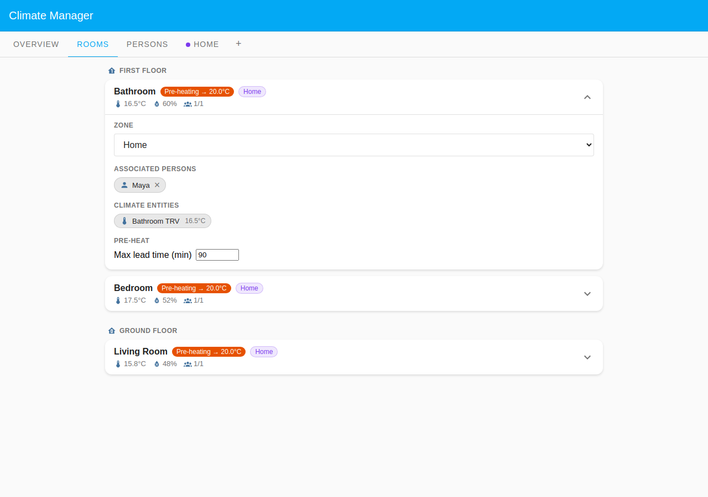

# Maya — Predictive Pre-heat

Maya wants her bedroom and bathroom to be warm when she wakes up, not to _start_
heating when she gets out of bed. With **Pre-heat** enabled on the Home zone,
the coordinator looks ahead to the 06:30 Normal period and begins heating early
— using each room's allowed lead time — so the rooms reach target temperature
right as the morning period begins. Maya is home asleep overnight and that
counts as **present**, so pre-heat can run ahead of the wake-up step.

## Household layout

| Room        | Zone                | Floor        | Heats when                           |
| ----------- | ------------------- | ------------ | ------------------------------------ |
| Bedroom     | Home (Default Zone) | First Floor  | Time program + pre-heat before 06:30 |
| Bathroom    | Home (Default Zone) | First Floor  | Time program + pre-heat before 06:30 |
| Living Room | Home (Default Zone) | Ground Floor | Time program + pre-heat before 06:30 |

The Default Zone **Home** uses **Time program & presences** and has **Pre-heat**
enabled. All three rooms have Maya in their **Room associations**, so all three
are eligible for pre-heat. A room with no assigned person in a presences zone
would be set back, not pre-heated.

## Presence configuration

Maya uses **Scheduled** presence mode (single week).

| Day       | Present                              | Away          |
| --------- | ------------------------------------ | ------------- |
| Mon–Fri   | Overnight, before 08:30, after 17:30 | 08:30 – 17:30 |
| Sat / Sun | All day                              | —             |

Asleep at home overnight is **present** — absence is only for the hours Maya is
actually out of the house. Pre-heat fires at ~05:50 on weekday mornings while
Maya is home asleep, ahead of the 06:30 Normal period.

Pre-heat tuning:

- **Max lead time (min)** per room — Bedroom 60 min, Bathroom 90 min: the
  maximum head-start the coordinator may take for those rooms. The Living Room
  has no explicit **Max lead time (min)** cap, so the zone's default applies and
  it also begins pre-heating.
- Pre-heat is driven by the zone **Pre-heat** toggle and each room's **Max lead
  time (min)** setting. The **Wake-up advance** field applies only to
  Calendar-mode persons and is not used here.

## Rooms driven by Maya

Maya has **Bedroom**, **Bathroom**, and **Living Room** in her **Room
associations** — all three rooms are in the Home zone (**Time program &
presences**), so each must have an assigned person or it would never heat to its
scheduled period. All three pre-heat toward 20.0°C ahead of the 06:30 step.

## Screenshots

### Overview tab

Captured at 05:50 on a Wednesday morning: Maya is home asleep (present, green
dot), the Home zone is in its overnight Reduced active period (**Time program &
presences**), and pre-heat is already running across all rooms ahead of the
06:30 Normal step.

### Rooms tab

All three rooms carry a **Pre-heating → 20.0°C** badge. The expanded Bathroom
card shows Maya in Associated Persons, the Bathroom TRV at 16.5°C, and **Max
lead time (min)** set to 90. Bedroom likewise shows the pre-heat badge with
17.5°C current and 52% humidity. Living Room (Ground Floor) also shows
Pre-heating → 20.0°C at 15.8°C — all three rooms are warming toward the 06:30
Normal period.

### Persons tab — Maya card expanded

Maya's card shows her **Single week** schedule with present overnight and absent
08:30–17:30 on weekdays. Room associations list Bathroom and Bedroom (First
Floor) and Living Room (Ground Floor) — the three rooms whose pre-heat and
schedule her presence gates in the Home zone.

### Home zone schedule

The single **Home** zone runs in **Time program & presences** mode with
**Pre-heat** enabled. The schedule still bounds heating — pre-heat only brings
the _start_ of a scheduled period forward so each room reaches target on time.

Weekdays heat Normal 06:30–09:00, Reduced midday, Normal 17:00–22:30; weekends
hold Comfort 08:00–22:30. The 06:30 Normal period is the first of the weekday,
so with pre-heat each room starts climbing before 06:30 (up to its Max lead
time) to hit target by 06:30 — but the zone still cannot heat after the 22:30
Frost boundary, present or not.
