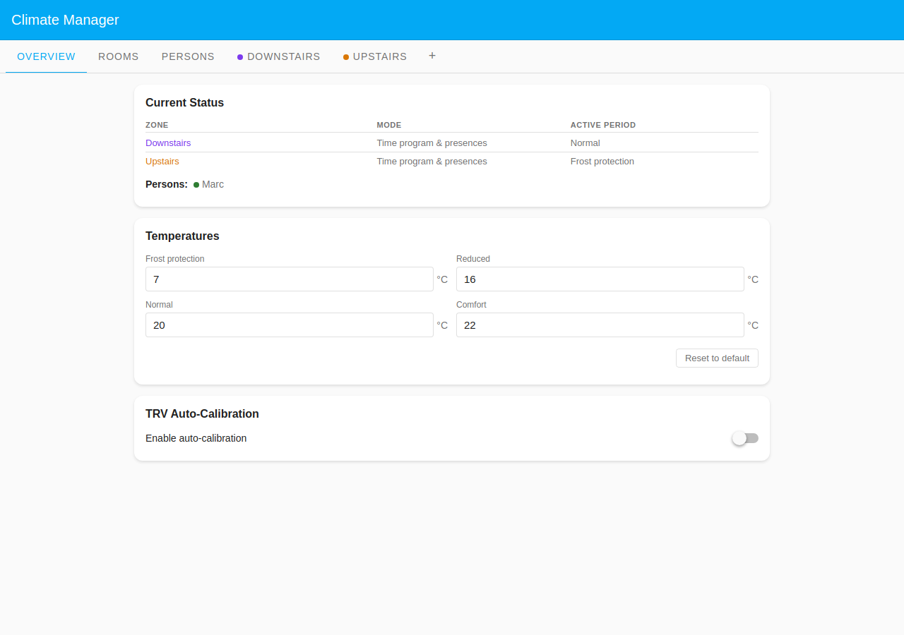
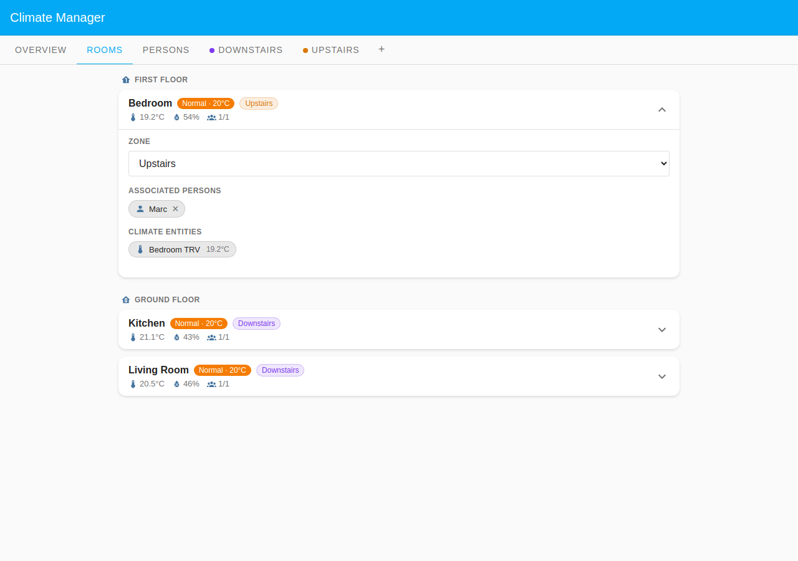

# Marc — Rotating Shift Worker

Marc works irregular rotating shifts at a factory — early mornings one week,
late nights the next. His home presence follows no predictable weekly pattern,
so a fixed time-bar schedule would constantly be wrong. Instead the integration
tracks the live `person.marc` HA entity using **HA home tracking**, which
follows Marc's `person.*` / device_tracker state directly. Rooms heat while he
is home and set back to Reduced when he leaves — no schedule editor needed.

## Household layout

| Room        | Zone                      | Floor        | Heats when   |
| ----------- | ------------------------- | ------------ | ------------ |
| Bedroom     | Upstairs (custom zone)    | First Floor  | Marc is home |
| Living Room | Downstairs (Default Zone) | Ground Floor | Marc is home |
| Kitchen     | Downstairs (Default Zone) | Ground Floor | Marc is home |

Both zones use `time_program_presences` mode. Rooms heat to their zone's
time-program schedule while Marc is home; when he leaves all rooms fall back to
Reduced regardless of the scheduled period.

## Presence configuration

Marc's person config uses `mode: 'ha'` (**HA home tracking**). No schedule
arrays are stored. The integration reads `person.marc`'s `home` / `not_home`
state from HA at each evaluation cycle, derived from
`device_tracker.marc_phone`.

Because `device_trackers` is set to a non-empty list in HA's person entity
attributes, the panel renders the clean **HA** badge on Marc's card. If the
tracker list were empty the card would show a warning badge instead.

This mode is the right choice for anyone whose schedule is irregular enough that
no weekly repeat pattern is practical — shift workers, on-call staff, or people
with highly variable routines. The person card shows no schedule editor.

## Rooms driven by Marc

Marc's `room_ids` are **all three rooms**: bedroom, living_room, and kitchen.
Every room is gated by his presence — heating follows the zone schedule while he
is home and sets back when he is away.

| Room        | Tracked for presence |
| ----------- | -------------------- |
| Bedroom     | yes                  |
| Living Room | yes                  |
| Kitchen     | yes                  |

## Screenshots

### Overview tab

The Overview tab shows the two zones (Downstairs and Upstairs), both in
`time_program_presences` mode, and Marc's presence state. All three rooms show a
non-zero person count while he is home.

### Rooms tab

The Rooms tab lists all three rooms grouped by floor. Bedroom is badged with the
Upstairs zone colour; Living Room and Kitchen show the Downstairs (Default Zone)
badge. Each card shows live temperature and humidity from the TRV.

### Persons tab — Marc card expanded

The expanded Marc card shows the mode selector set to **HA** (HA home tracking)
and an explanatory hint. No schedule editor is rendered — this is the deliberate
contrast with schedule-driven cards (e.g. simple-schedule or
student-mixed-schedule), where a time-bar editor appears on expand. All three
room chips appear grouped by floor.
