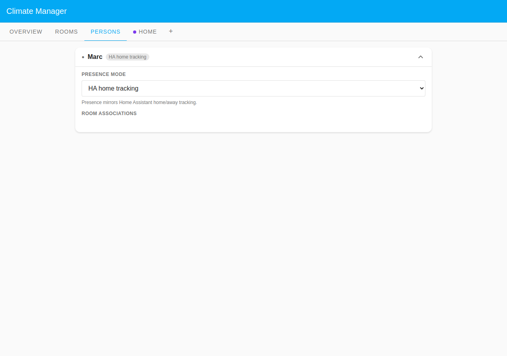
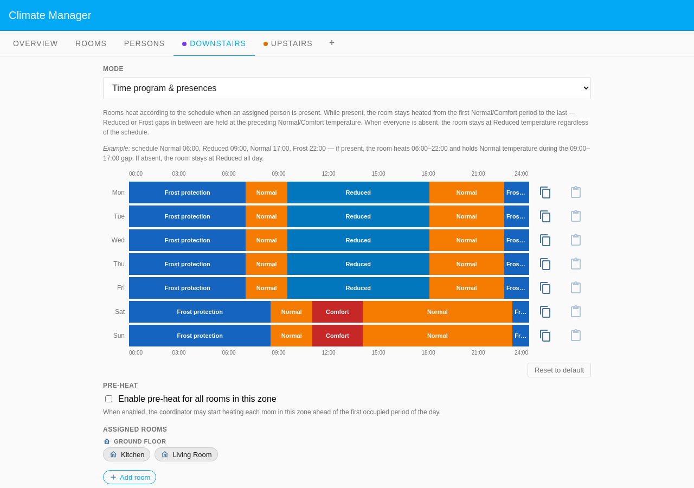
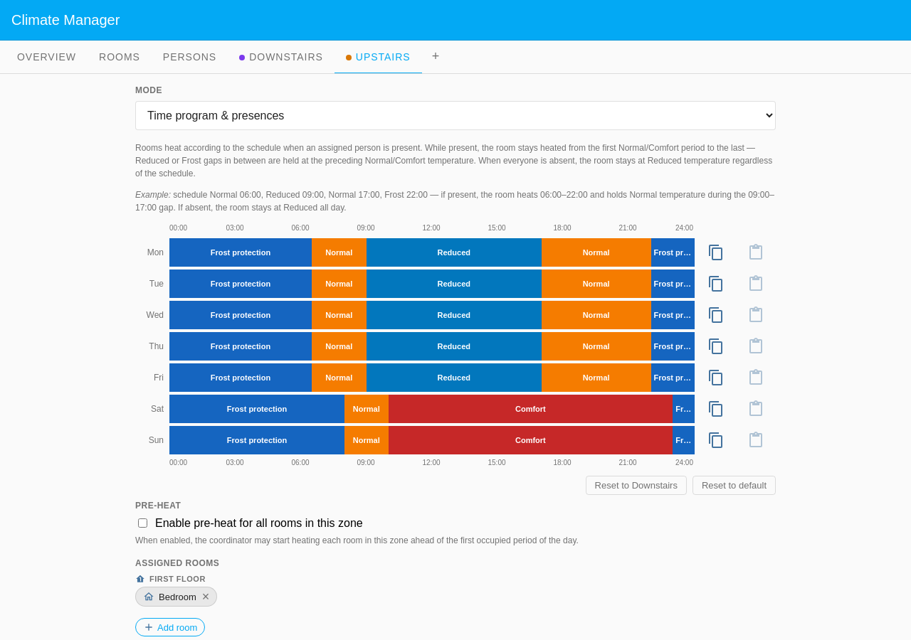
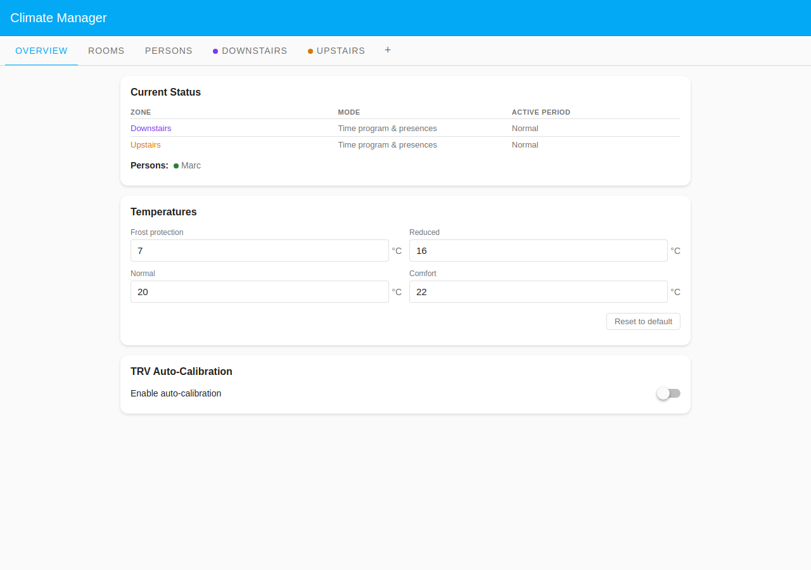
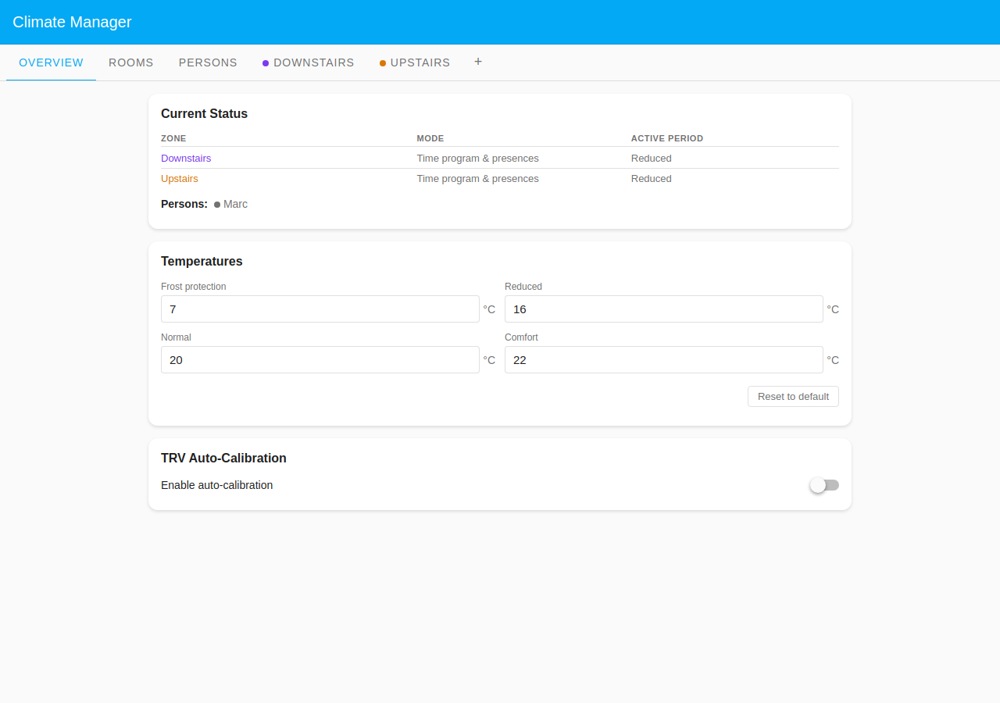
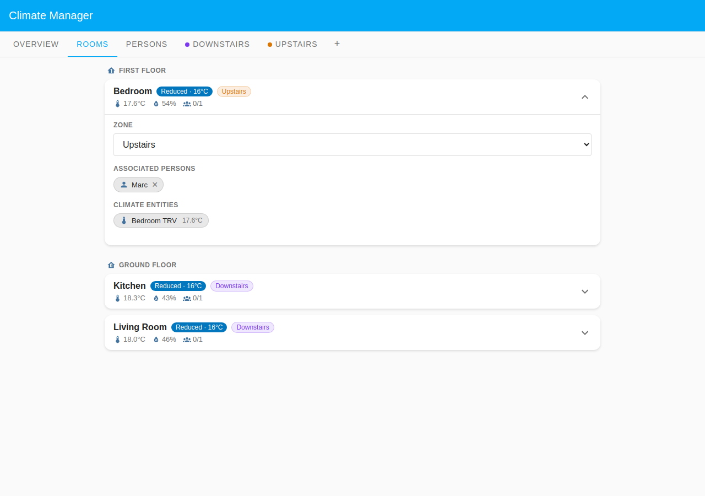

# Marc: Rotating Shift Worker

Marc works irregular rotating shifts at a factory: early mornings one week, late
nights the next. His home presence follows no predictable weekly pattern, so a
fixed time-bar schedule would constantly be wrong. Instead the integration
tracks Marc's HA person entity using **HA home tracking**, which follows his
home/away state directly: rooms heat while he is home and set back to Reduced
when he leaves, with no schedule editor needed.

The two states below are pinned to the **same moment**, Wednesday 14:00, when
both zones' schedule is in its midday **Reduced** dip; they differ only in
whether HA reports Marc home. That isolates two behaviours at once: the presence
gate, and **gap-fill**. Because 14:00 sits between the morning and evening
Normal periods, a returning Marc is held at Normal even though the raw schedule
says Reduced.

## Table of Contents

- [Configuration](#configuration)
  - [Household layout](#household-layout)
  - [Presence configuration](#presence-configuration)
  - [Zone schedules](#zone-schedules)
- [What happens](#what-happens)

## Configuration

### Household layout

| Room        | Zone                      | Floor        | Heats when   |
| ----------- | ------------------------- | ------------ | ------------ |
| Bedroom     | Upstairs (custom zone)    | First Floor  | Marc is home |
| Living Room | Downstairs (Default Zone) | Ground Floor | Marc is home |
| Kitchen     | Downstairs (Default Zone) | Ground Floor | Marc is home |

Both zones use **Time program & presences** mode. Marc has all three rooms in
his **Room associations**, so every room is gated by his presence.

### Presence configuration

Marc's person config uses **HA home tracking**, with no schedule arrays. The
integration reads his HA person entity's home/away state at each evaluation
cycle, derived from his phone's device tracker.

The expanded Marc card shows the Presence mode selector set to **HA home
tracking** and the hint "Presence mirrors Home Assistant home/away tracking." No
schedule editor is rendered: the deliberate contrast with schedule-driven cards.
This mode suits anyone whose schedule is too irregular for a weekly repeat:
shift workers, on-call staff, variable routines.

### Zone schedules

Both floors run in **Time program & presences** mode, so each zone's weekly
schedule bounds heating; Marc's presence only gates it.

**Downstairs** heats Normal 07:00–09:30, Reduced through midday, Normal
18:00–22:30 on weekdays, with a Normal/Comfort weekend block 08:30–23:00.

**Upstairs** heats Normal 06:30–09:00 and 17:00–22:00 on weekdays,
Normal/Comfort 08:00–23:00 at weekends.

## What happens

### When Marc comes home mid-shift (Wednesday 14:00)

Marc finishes a morning shift and walks in at 14:00, while both zones' raw
schedule is in the midday **Reduced** dip. Because he is within the day's
occupied window (between the morning and evening Normal periods), gap-fill holds
every room at the preceding **Normal** temperature rather than the dip, so the
house is comfortable the moment he is back rather than three hours later.

The Overview shows both zones at **Normal** (gap-filled) with Marc present
(green dot). Crucially the custom Upstairs zone agrees with its own room card,
no longer showing the raw Reduced period.

All three rooms carry a **Normal · 20°C** badge with **1/1** present, even
though the schedule grid for this hour reads Reduced.

### When Marc is on shift (Wednesday 14:00)

Same moment, but HA reports Marc away. With nobody home the presence gate is
closed and gap-fill does not apply: the rooms simply sit at the schedule's
midday **Reduced** level.

The Overview shows Marc absent (grey dot) and both zones at **Reduced**.

Every room shows **Reduced · 16°C** and **0/1** present, with TRV temperatures
drifting down. The house stays cool until HA next reports Marc home.
