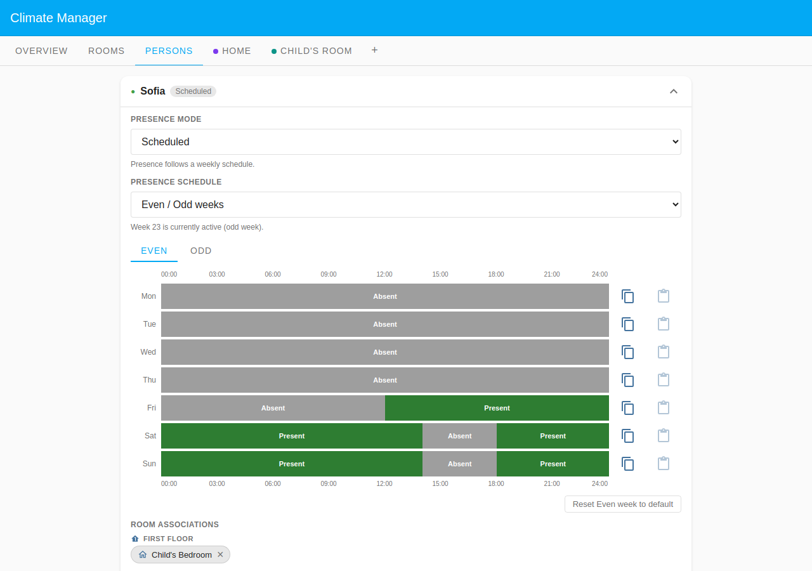
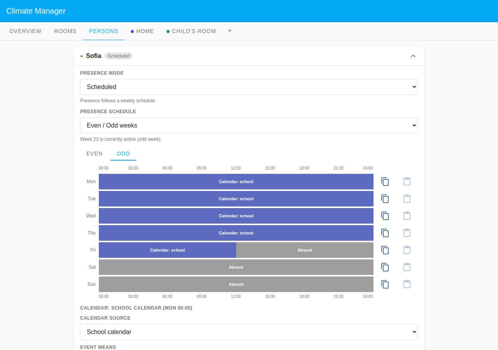
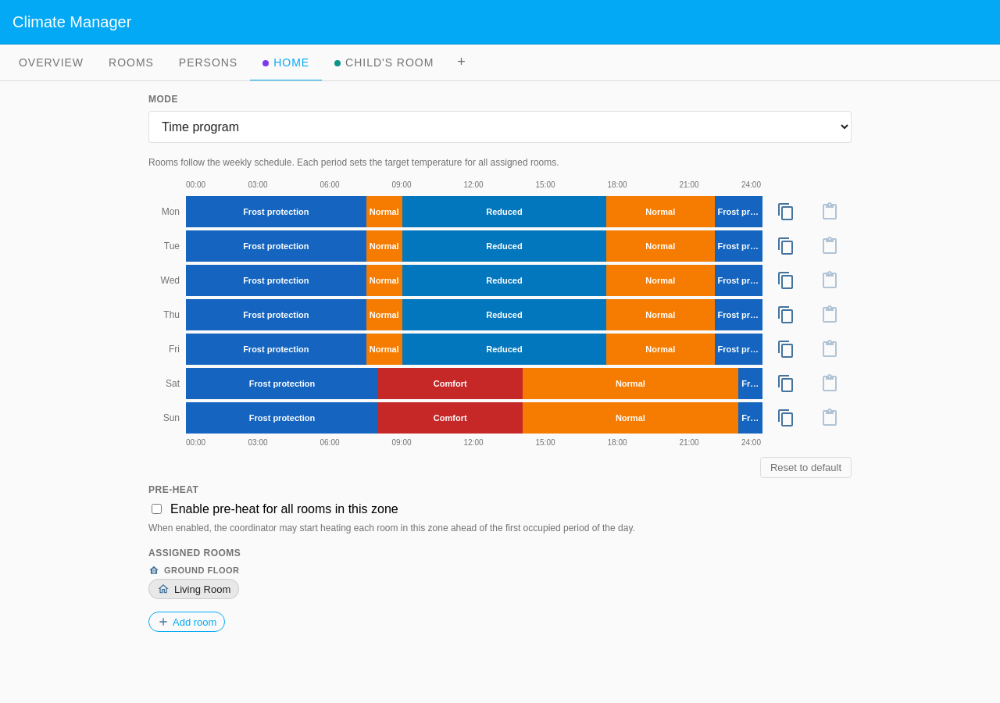
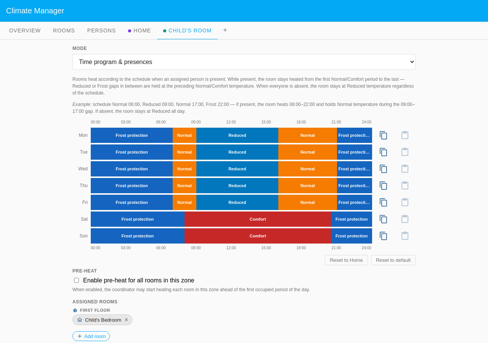
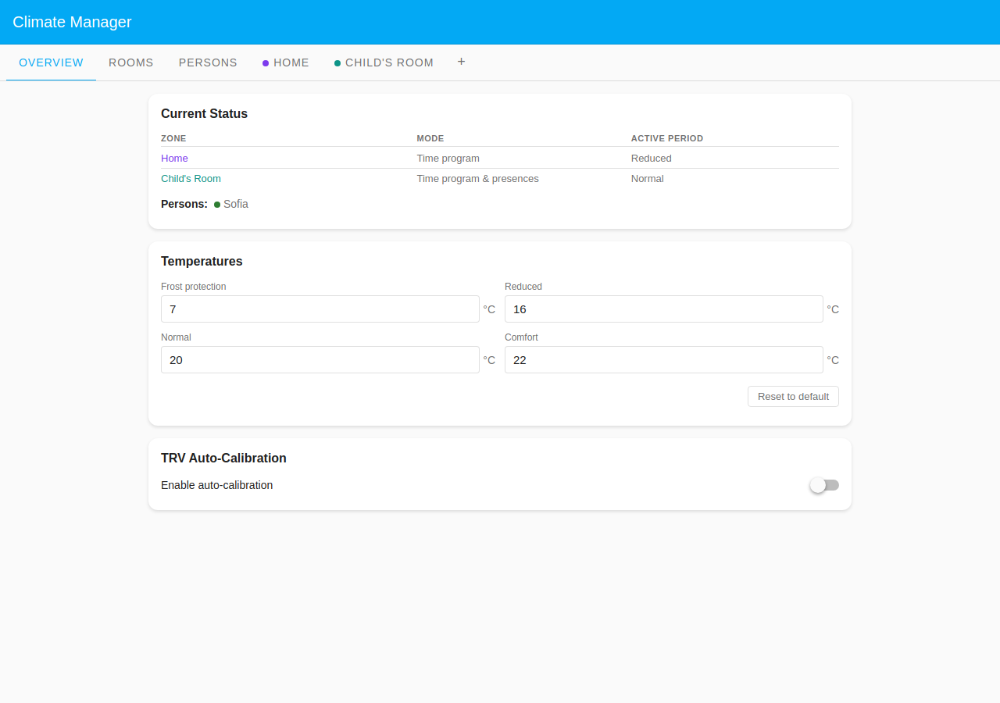
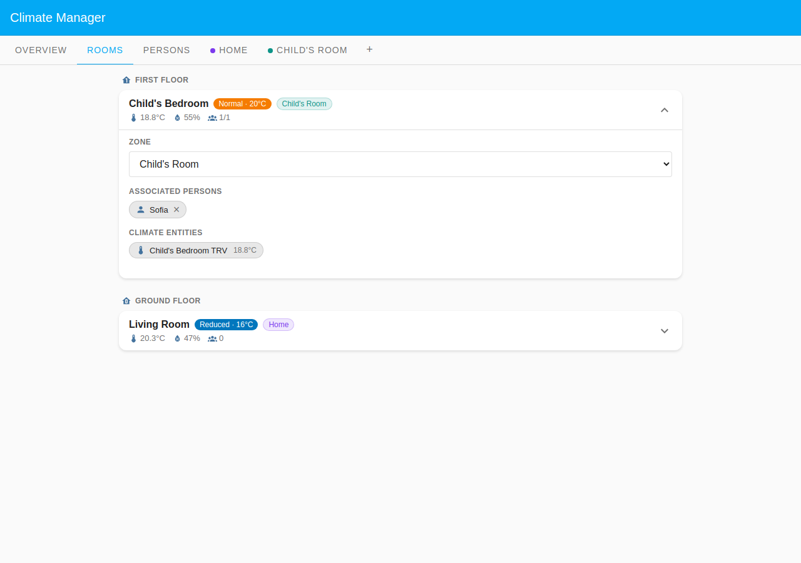
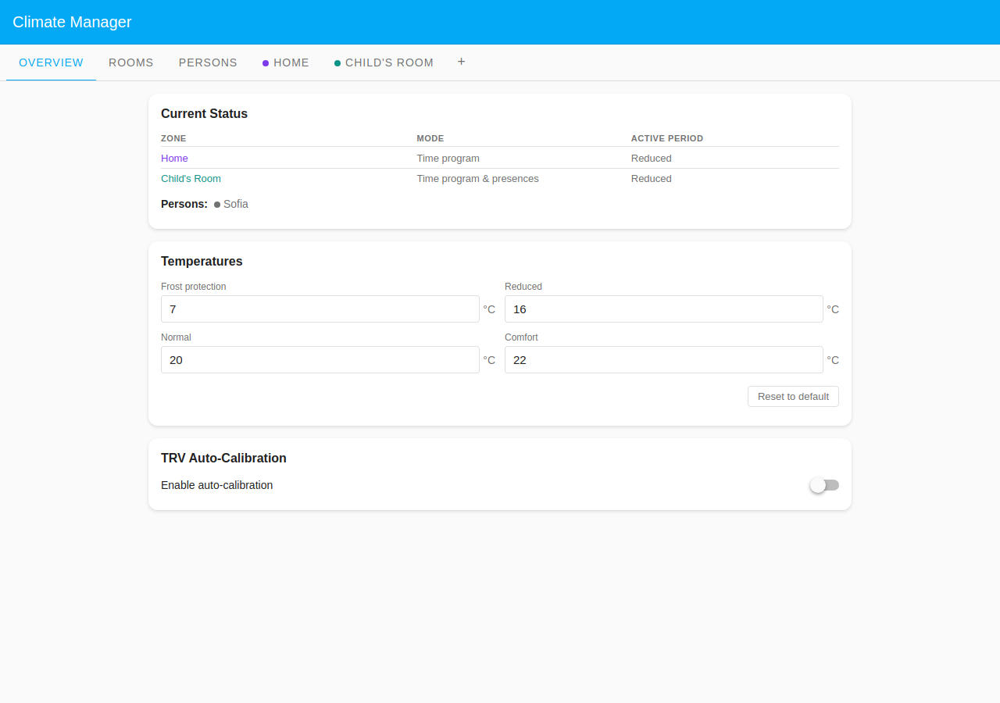
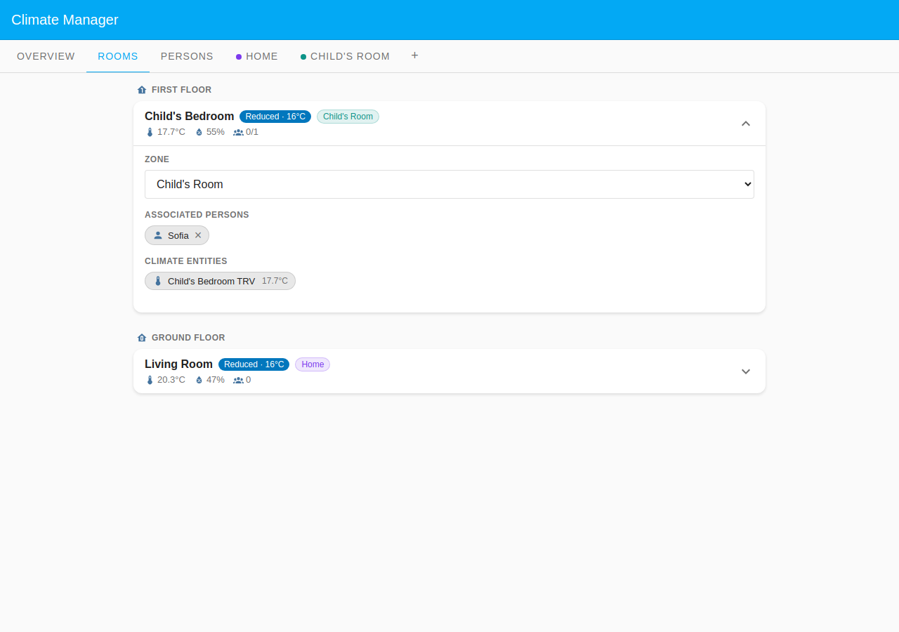

# Sofia: Shared Custody (Odd/Even Weeks)

Sofia is a child who alternates between two homes under a shared-custody
arrangement. The hand-over happens **every Friday at noon**, so one week she is
here for the school days and leaves for the weekend, and the alternate week she
arrives for the weekend and is away during the school days. This example shows
how the **Even / Odd weeks** presence schedule combines with a **per-day
Calendar** source and a **manual weekend schedule** in one person config.

On a school day Sofia's presence is driven minute-by-minute by her **School
calendar** timetable: in class she is at school (absent), after class she is
home. The two states below show that contrast on the same odd week (Wednesday,
ISO week 23), and how only the presence-gated Child's Room responds while the
shared Living Room follows its own program regardless.

## Configuration

### Household layout

| Room            | Zone                       | Floor        | Heats when                       |
| --------------- | -------------------------- | ------------ | -------------------------------- |
| Child's Bedroom | Child's Room (custom zone) | First Floor  | Sofia present (per the schedule) |
| Living Room     | Home (Default Zone)        | Ground Floor | Time program (always scheduled)  |

The **Child's Room** custom zone uses **Time program & presences**: it heats on
its own schedule only when Sofia is present. The **Home** Default Zone runs a
plain **Time program** for the living room, a shared family space that heats on
schedule regardless of who is home, so it needs no person assigned.

### Presence configuration

Sofia's presence mode is **Scheduled** with an **Even / Odd weeks** schedule,
and each week's program is itself mixed: weekdays driven by the **School
calendar** Calendar source, the weekend a hand-set manual schedule. The custody
hand-over at **Friday noon** splits Friday at 12:00 in both programs.

#### Odd week: here for the school week, leaves Friday noon

| Mon–Thu         | Fri                                   | Sat    | Sun    |
| --------------- | ------------------------------------- | ------ | ------ |
| School calendar | School calendar to 12:00, then absent | Absent | Absent |

On school days the timetable drives presence: while a class event is active the
child is at school (absent); after school she is home. The Calendar source is
**Absent during events**, and only a gap longer than 60 minutes between classes
counts as a return home.

#### Even week: arrives Friday noon, manual weekend

| Mon–Thu | Fri                          | Sat (manual)                         | Sun (manual)                         |
| ------- | ---------------------------- | ------------------------------------ | ------------------------------------ |
| Absent  | Absent until 12:00 → present | Present, out 14:00–18:00, back 18:00 | Present, out 14:00–18:00, back 18:00 |

The expanded Sofia card has an **Even / Odd weeks** selector (it notes "Week 23
is currently active (odd week)"), with a tab for each week. Both schedules are
shown below.

The **Even** week is the off week: Mon–Thu Absent, Friday flips to Present at
noon (the hand-over), and the weekend is a hand-set manual schedule (Present
with an afternoon out 14:00–18:00).

The **Odd** week is the school week: Mon–Thu are "Calendar: school" bars driven
by the School calendar timetable, Friday flips to Absent at noon, and the
weekend is Absent. Below the bars, the Calendar config panel shows the **School
calendar** source. The room chip lists Child's Bedroom, the only presence-gated
room Sofia drives.

### Zone schedules

The **Home** zone (plain Time program) heats Normal 07:30–09:00 and 17:30–22:00
on weekdays, Comfort/Normal 08:00–23:00 at weekends, the same whoever is home.

**Child's Room** (Time program & presences) heats Normal 07:00–09:00 and
16:00–21:00 on weekdays, Comfort 08:00–20:30 at weekends. It follows this only
when Sofia is present; otherwise it holds Reduced.

## What happens

### When the school day is over (Wednesday 16:30)

The last class ended at 16:00, so the school calendar reports no active event
and Sofia is home. The Child's Room presence gate opens.

The Overview shows Sofia present (green dot); Child's Room at **Normal**, Home
at **Reduced** (its own evening ramp has not started yet).

Child's Bedroom shows **Normal · 20°C** with **1/1** present. The Living Room
sits at **Reduced · 16°C** with **0** persons, driven purely by the Home
schedule, no presence involved.

### When a class is in session (Wednesday 10:00)

A class runs 08:00–12:00, so the school calendar marks the child at school. The
Child's Room presence gate closes.

The Overview shows Sofia absent (grey dot) and Child's Room fallen back to
**Reduced**.

Child's Bedroom now shows **Reduced · 16°C** with **0/1** present. The Living
Room is unchanged from its own schedule: the custody presence only governs the
Child's Room.
