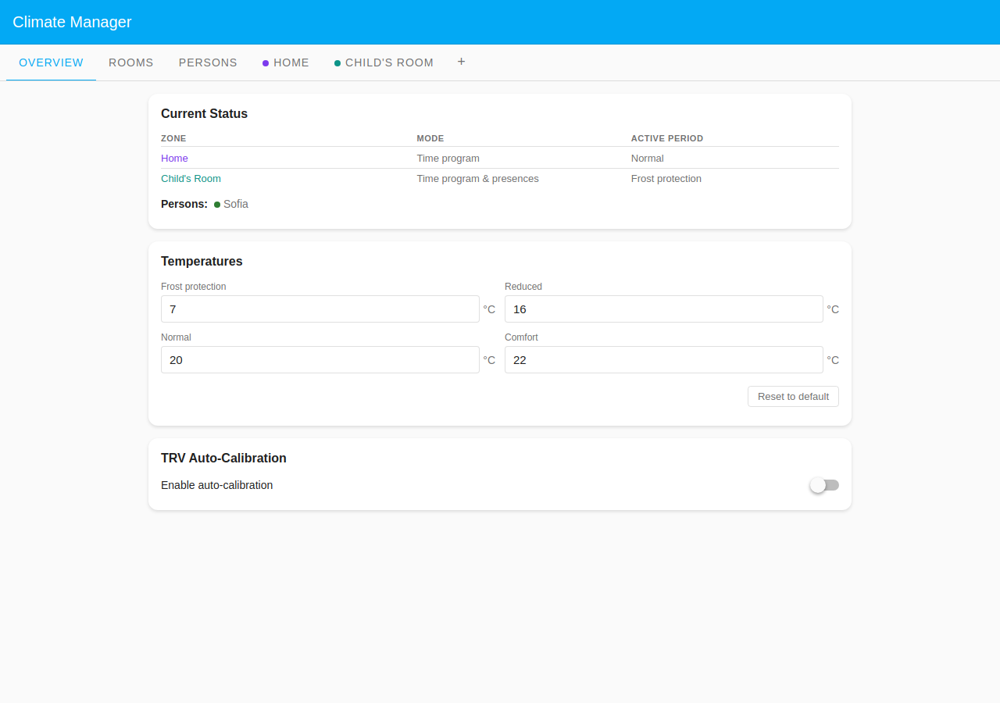
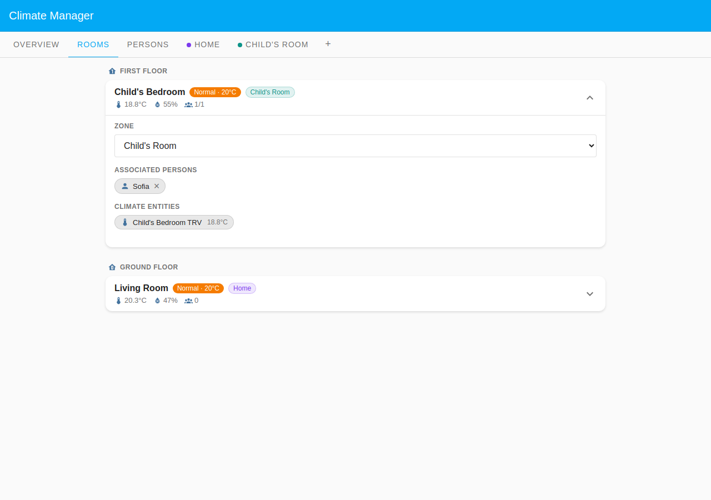
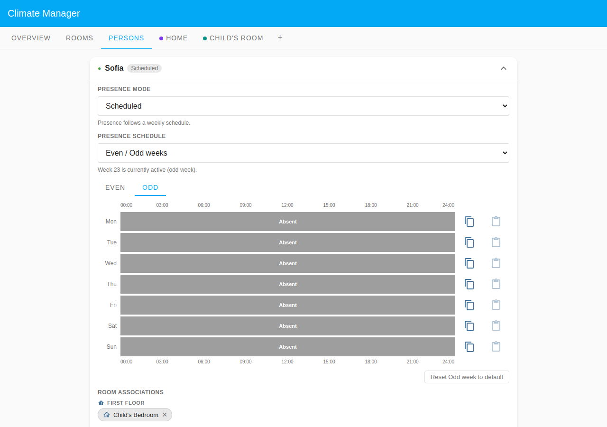

# Sofia — Shared Custody (Odd/Even Weeks)

Sofia is a child who alternates between two homes under a shared-custody
arrangement. The hand-over happens **every Friday at noon**, so one week she is
here for the school days and leaves for the weekend, and the alternate week she
arrives for the weekend and is away during the school days. This example shows
how the **scheduled even/odd weeks** mode combines with a **per-day calendar**
and a **manual weekend schedule** in a single person config — automating a
genuinely mixed custody pattern with no manual intervention when the week flips.

## Household layout

| Room            | Zone                       | Floor        | Heats when                       |
| --------------- | -------------------------- | ------------ | -------------------------------- |
| Child's Bedroom | Child's Room (custom zone) | First Floor  | Sofia present (per the schedule) |
| Living Room     | Home (Default Zone)        | Ground Floor | Time program (always scheduled)  |

The **Home** Default Zone runs a standard time program for the living room. The
**Child's Room** custom zone uses `time_program_presences` mode — it heats
according to its own schedule only when Sofia is marked present.

## Presence configuration

Sofia's config uses `mode: 'scheduled'` with `schedule_type: 'even_odd'`, but
each week's program is itself **mixed**: weekdays are driven by the **Pronote**
school calendar (a per-period `state: 'calendar'` pointing at
`calendar.pronote`) and the weekend is a **hand-set manual** schedule. The
custody hand-over at **Friday noon** means Friday is split at `12:00` in both
programs.

### Odd week — here for the school week, leaves Friday noon

| Mon–Thu          | Fri                          | Sat    | Sun    |
| ---------------- | ---------------------------- | ------ | ------ |
| Pronote calendar | Pronote until 12:00 → absent | Absent | Absent |

On school days, the Pronote timetable drives presence: while a class event is
active the child is at school (absent); after school and long gaps count as home
(`event_means: 'absent'`, `gap_handling: 'threshold'`, 60 min).

### Even week — arrives Friday noon, manual weekend

| Mon–Thu | Fri                          | Sat (manual)                         | Sun (manual)                         |
| ------- | ---------------------------- | ------------------------------------ | ------------------------------------ |
| Absent  | Absent until 12:00 → present | Present, out 14:00–18:00, back 18:00 | Present, out 14:00–18:00, back 18:00 |

The weekend days use hand-set present/absent periods (e.g. an afternoon out),
which read as plain manual bars rather than calendar bars.

**Note on screenshots:** The panel computes the active week parity from the real
system clock at capture time (`getWeekParity(new Date())`). The persons
screenshot shows whichever week tab is currently active; both **Even** and
**Odd** tabs exist on the card and can be toggled in the live UI. On the Odd
tab, the weekday bars carry an inline **Calendar: Pronote — Collège** config
block; on the Even tab, the weekend bars are plain manual periods.

## Rooms driven by Sofia

Sofia is assigned to the **Child's Bedroom** only
(`room_ids: ['child_bedroom']`). That room is in the presence-driven **Child's
Room** zone, so it follows the schedule when she is marked present and falls
back to Reduced when she is absent. The **Living Room** is in the **Home** zone
on a plain time program — it is a shared family space that heats on schedule
regardless of who is home, so it needs no person assigned.

## Screenshots

### Overview tab

The Overview tab shows the two zones (Home and Child's Room) with their current
modes. The Child's Room zone badge reflects `time_program_presences`. Sofia's
presence state reflects the active week at capture time.

### Rooms tab

The Rooms tab lists Child's Bedroom (First Floor, Child's Room zone badge) and
Living Room (Ground Floor, Default Zone badge). Temperature and humidity
readings are shown for each TRV.

### Persons tab — Sofia card expanded

The expanded Sofia card shows the **Even / Odd** week-switcher tabs and the
schedule bars for the active week. The screenshot reflects whichever parity is
current at capture time — the Odd tab shows Pronote-calendar weekdays with a
Friday-noon split, the Even tab shows the manual weekend schedule. The room chip
lists Child's Bedroom (First Floor) — the only presence-gated room Sofia drives.
