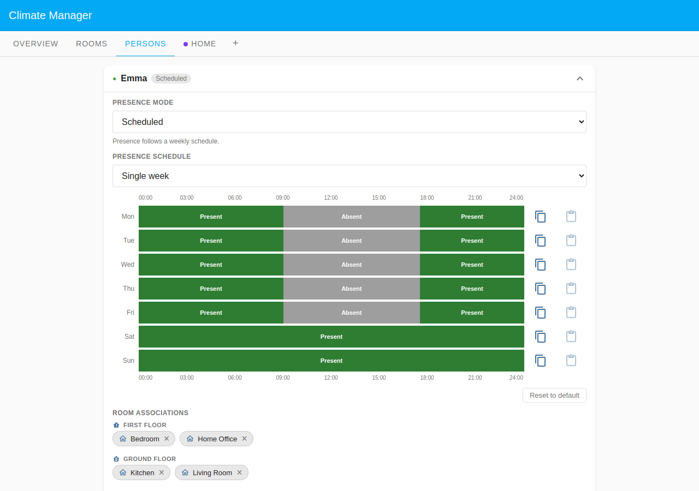

# Emma — Simple Schedule

Emma lives alone in a two-storey house and follows a standard office week. She
leaves for work every weekday morning and returns in the late afternoon, while
weekends are entirely hers at home. This scenario shows the simplest possible
Climate Manager setup: a **single Default Zone** in `time_program_presences`
mode, four rooms, and one person on a **scheduled (single-week)** presence
programme.

The zone is **presence-driven**: rooms follow the time-program schedule while
Emma is home and fall back to Reduced while she is at work (09:00–17:30). She is
present overnight — "absent" only covers the hours she is physically out of the
house.

## Household layout

| Room        | Zone         | Floor        | Heats when                       |
| ----------- | ------------ | ------------ | -------------------------------- |
| Living Room | Default Zone | Ground Floor | Zone schedule while Emma is home |
| Kitchen     | Default Zone | Ground Floor | Zone schedule while Emma is home |
| Bedroom     | Default Zone | First Floor  | Zone schedule while Emma is home |
| Home Office | Default Zone | First Floor  | Zone schedule while Emma is home |

## Presence configuration

Emma uses **mode: scheduled**, **schedule_type: single** — the same pattern
repeats every week with no alternation.

### Schedule

| Day     | Present                        | Absent      |
| ------- | ------------------------------ | ----------- |
| Mon–Fri | 00:00–09:00, 17:30 to midnight | 09:00–17:30 |
| Sat–Sun | all day (00:00 onwards)        | —           |

Emma is present overnight. She is marked absent only during the hours she is
physically away at work (09:00–17:30 on weekdays).

## Rooms driven by Emma

Emma's `room_ids` are **all four rooms**: bedroom, home_office, living_room, and
kitchen. Because the zone is `time_program_presences`, every room needs at least
one assigned person to receive scheduled heat. All four rooms show a non-zero
`present_person_count` when Emma is home.

| Room        | Tracked for presence |
| ----------- | -------------------- |
| Bedroom     | yes                  |
| Home Office | yes                  |
| Living Room | yes                  |
| Kitchen     | yes                  |

## Screenshots

### Overview

The Overview tab shows the Default Zone (Home) in `time_program_presences` mode
with the active period and Emma marked as currently present; all four rooms show
a non-zero person count.

### Rooms

All four rooms appear under the single Default Zone group, each with live
temperature and humidity from their TRV entity.

### Persons

The expanded Emma card shows her single-week presence schedule: a repeating
weekday bar absent only 09:00–17:30, alongside fully-present Saturday and Sunday
bars. All four room chips appear grouped by floor.
