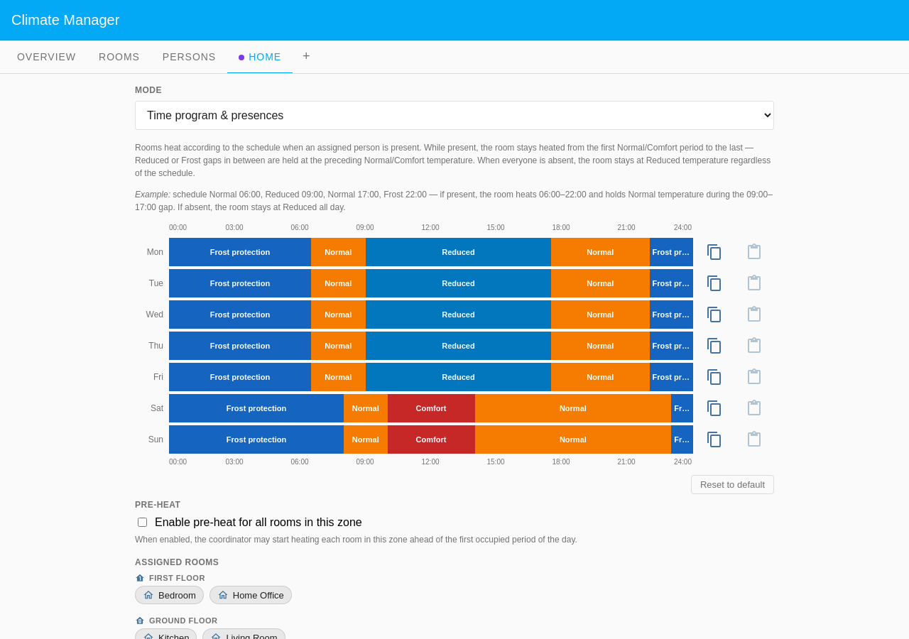
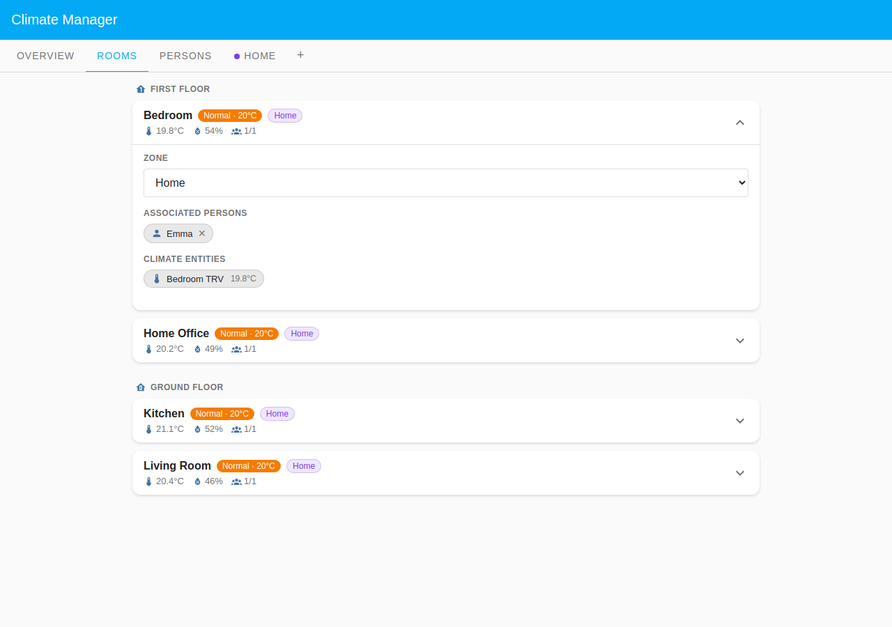
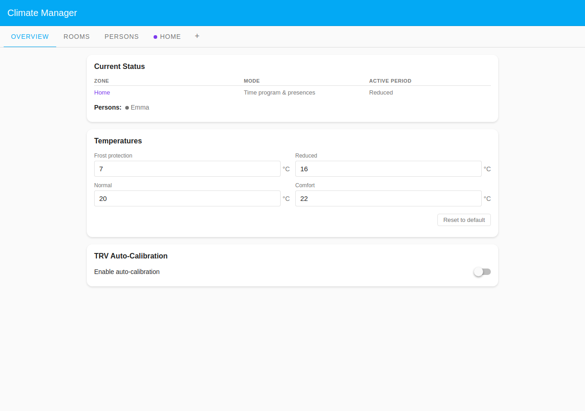
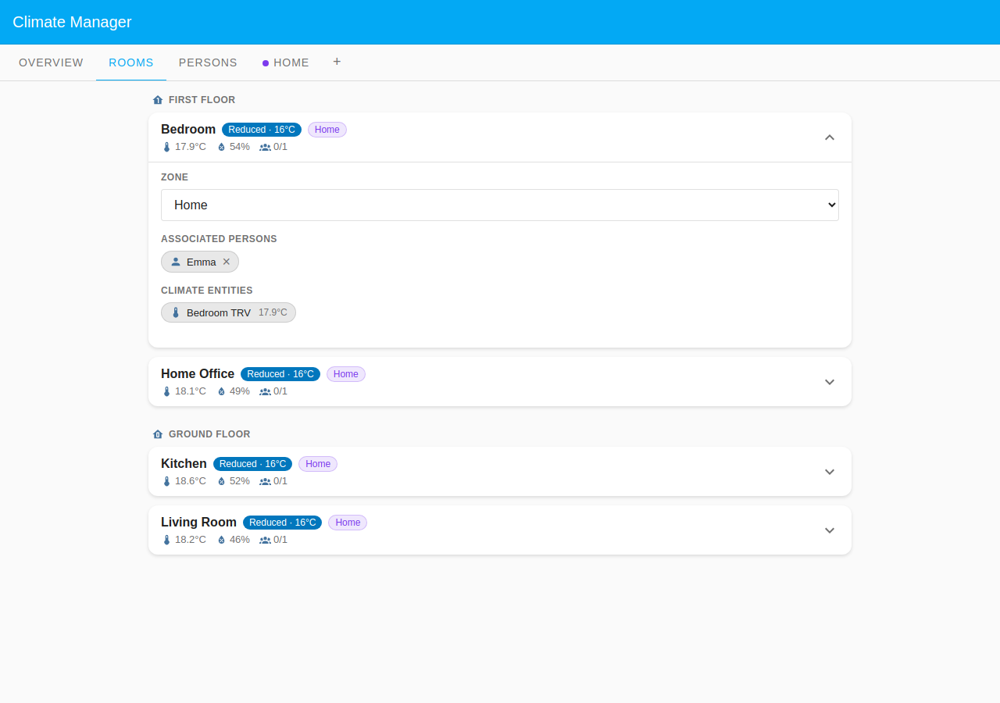

# Emma: Simple Schedule

Emma lives alone in a two-storey house and follows a standard office week. She
leaves for work every weekday morning and returns in the late afternoon, while
weekends are entirely hers at home. This scenario shows the simplest possible
Climate Manager setup: a **single Default Zone** in **Time program & presences**
mode, four rooms, and one person on a **Scheduled** / **Single week** presence
programme.

The whole point of the **Time program & presences** mode is the presence gate:
rooms follow the schedule while Emma is home and fall back to **Reduced** while
she is at work. The two states below show exactly that contrast.

## Table of Contents

- [Configuration](#configuration)
  - [Household layout](#household-layout)
  - [Presence configuration](#presence-configuration)
  - [Home zone schedule](#home-zone-schedule)
- [What happens](#what-happens)

## Configuration

### Household layout

| Room        | Zone         | Floor        | Heats when                       |
| ----------- | ------------ | ------------ | -------------------------------- |
| Living Room | Default Zone | Ground Floor | Zone schedule while Emma is home |
| Kitchen     | Default Zone | Ground Floor | Zone schedule while Emma is home |
| Bedroom     | Default Zone | First Floor  | Zone schedule while Emma is home |
| Home Office | Default Zone | First Floor  | Zone schedule while Emma is home |

Emma's **Room associations** cover all four rooms. Because the zone is **Time
program & presences**, every room needs at least one assigned person to receive
scheduled heat. A room with nobody assigned would never leave Reduced.

### Presence configuration

Emma uses **Scheduled** presence mode with a **Single week** schedule: the same
pattern repeats every week with no alternation.

| Day     | Present                        | Absent      |
| ------- | ------------------------------ | ----------- |
| Mon–Fri | 00:00–09:00, 17:30 to midnight | 09:00–17:30 |
| Sat–Sun | all day (00:00 onwards)        | none        |

Emma is present overnight; "absent" only covers the hours she is physically away
at work (09:00–17:30 on weekdays).

The expanded Emma card shows her **Single week** schedule: every weekday row
carries an identical Present/Absent/Present pattern, while Saturday and Sunday
are fully present. Room associations appear below, grouped by floor.

### Home zone schedule

The single **Home** zone runs in **Time program & presences** mode. The weekly
schedule sets the heating window; Emma's presence only decides whether it is
followed.

Weekdays heat Normal 06:30–09:00, drop to Reduced through the day, and return to
Normal 17:30–22:00; weekends ramp Normal 08:00, Comfort 10:00–14:00, then Normal
to 23:00. Outside those bands the zone holds Frost protection.

## What happens

### When Emma is home (Wednesday 19:00)

She returned from work at 17:30, so the presence gate is open and the schedule
applies.

The Overview shows the Home zone in active period **Normal** and Emma listed as
present (green dot).

All four rooms carry a **Normal · 20°C** badge with a **1/1** person count: the
schedule is being followed in every room Emma occupies.

### When Emma is away (Wednesday 12:00)

She is at work, so the presence gate is closed. The rooms hold **Reduced**
regardless of the schedule's warmer periods until she returns.

The Overview now shows Emma absent (grey dot) and the zone fell back to
**Reduced**.

Every room shows a **Reduced · 16°C** badge and a **0/1** person count, with the
TRV temperatures drifting down. No room can reach its scheduled Normal period
while Emma is out: that is the presence gate in action.
