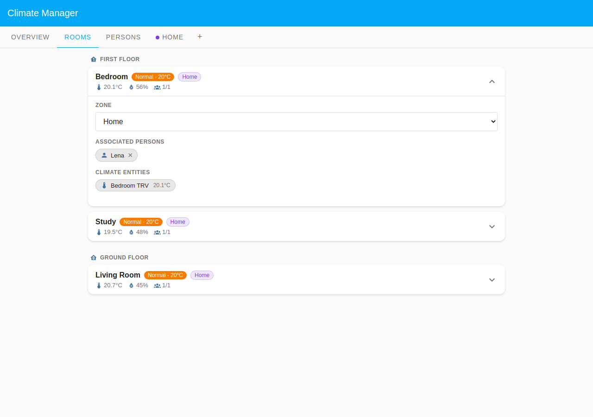
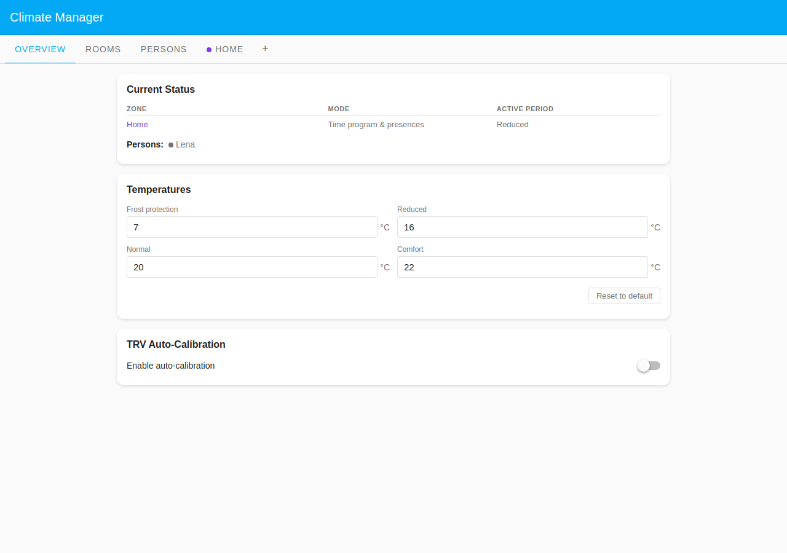
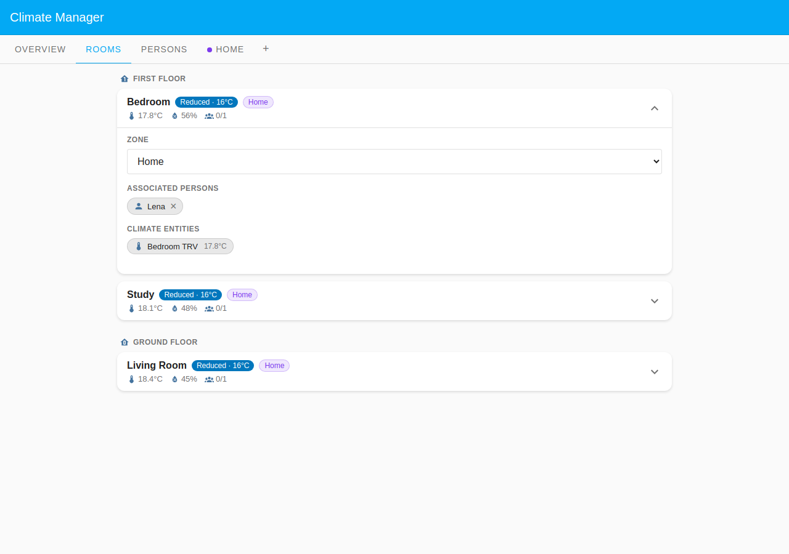

# Lena: Student Mixed Schedule

Lena is a university student whose lecture timetable changes every day of the
week: Monday is a long day of back-to-back sessions, Tuesday has a late-morning
slot only, Wednesday is the heaviest day, Thursday is a short morning, and
Friday finishes early afternoon. Weekends she is home all day. This scenario
demonstrates how a **Scheduled** / **Single week** presence programme can
express genuinely varied per-weekday absent blocks rather than a simple
repeating pattern.

The single zone is **Time program & presences**: all three rooms follow the
schedule while Lena is home and fall back to **Reduced** while she is at her
lectures. The two states below show that contrast on her heaviest day
(Wednesday, away 08:00–18:00).

## Table of Contents

- [Configuration](#configuration)
  - [Household layout](#household-layout)
  - [Presence configuration](#presence-configuration)
  - [Home zone schedule](#home-zone-schedule)
- [What happens](#what-happens)

## Configuration

### Household layout

| Room        | Zone         | Floor        | Heats when                       |
| ----------- | ------------ | ------------ | -------------------------------- |
| Bedroom     | Default Zone | First Floor  | Zone schedule while Lena is home |
| Study       | Default Zone | First Floor  | Zone schedule while Lena is home |
| Living Room | Default Zone | Ground Floor | Zone schedule while Lena is home |

Lena's **Room associations** cover all three rooms. Because the zone is **Time
program & presences**, every room needs at least one assigned person to receive
scheduled heat.

### Presence configuration

Lena uses **Scheduled** presence mode with a **Single week** schedule, but each
weekday has a different absent block.

| Day | Present                        | Absent      |
| --- | ------------------------------ | ----------- |
| Mon | 00:00–08:00, 16:00 to midnight | 08:00–16:00 |
| Tue | 00:00–10:00, 13:00 to midnight | 10:00–13:00 |
| Wed | 00:00–08:00, 18:00 to midnight | 08:00–18:00 |
| Thu | 00:00–09:00, 12:00 to midnight | 09:00–12:00 |
| Fri | 00:00–08:00, 14:00 to midnight | 08:00–14:00 |
| Sat | all day (00:00 onwards)        | none        |
| Sun | all day (00:00 onwards)        | none        |

Lena is present overnight; "absent" only covers the hours she is physically at
university.

The expanded Lena card highlights the per-day time bars: each weekday row shows
a distinct absent block of a different width (Wednesday's is the widest;
Tuesday's the narrowest), while Saturday and Sunday are fully present. Room
associations appear below, grouped by floor.

### Home zone schedule

The single **Home** zone runs in **Time program & presences** mode: the weekly
schedule bounds heating, and Lena's per-day presence only gates it.

Weekdays heat Normal 07:00–09:00, Reduced through the school day, then Normal
17:00–22:00; weekends are Normal 08:30 then Comfort 10:00–23:00. Before 07:00
and after 22:00 the zone is at Frost protection.

## What happens

### When Lena is home (Wednesday 19:00)

Her heaviest class day ended at 18:00, so the presence gate is open and the
schedule applies.

The Overview shows the Home zone at **Normal** with Lena present (green dot).

All three rooms carry a **Normal · 20°C** badge with a **1/1** person count.

### When Lena is away (Wednesday 12:00)

She is in lectures, so the presence gate is closed and every room is held back.

The Overview now shows Lena absent (grey dot) and the zone fell back to
**Reduced**.

Every room shows a **Reduced · 16°C** badge and a **0/1** person count. No room
heats to its scheduled Normal period while Lena is out.
