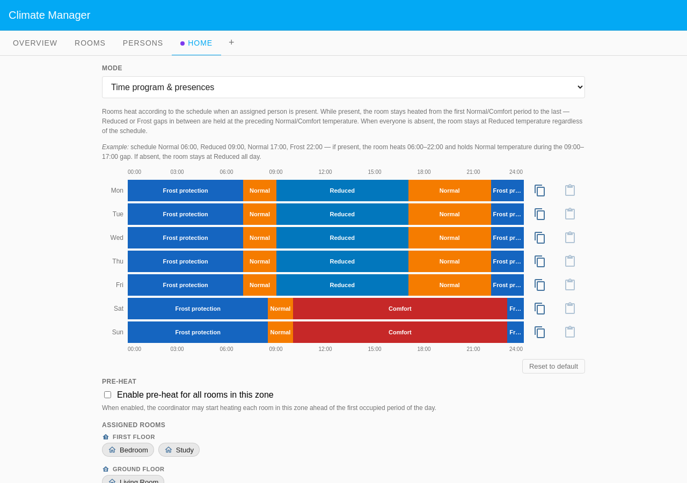

# Lena — Student Mixed Schedule

Lena is a university student whose lecture timetable changes every day of the
week: Monday is a long day of back-to-back sessions, Tuesday has a late-morning
slot only, Wednesday is the heaviest day, Thursday is a short morning, and
Friday finishes early afternoon. Weekends she is home all day. This scenario
demonstrates how a **Scheduled** / **Single week** presence programme can
express genuinely varied per-weekday absent blocks rather than a simple
repeating pattern.

The zone is **presence-driven** (**Time program & presences**): all three rooms
follow the time-program schedule while Lena is home and fall back to Reduced
while she is at her lectures. She is present overnight — "absent" only covers
the hours she is physically at university.

The screenshots are pinned to **Wednesday at 19:00** — Lena's longest day ended
at 18:00, so all three rooms are now heating to Normal.

## Household layout

| Room        | Zone         | Floor        | Heats when                       |
| ----------- | ------------ | ------------ | -------------------------------- |
| Bedroom     | Default Zone | First Floor  | Zone schedule while Lena is home |
| Study       | Default Zone | First Floor  | Zone schedule while Lena is home |
| Living Room | Default Zone | Ground Floor | Zone schedule while Lena is home |

## Presence configuration

Lena uses **Scheduled** presence mode with a **Single week** schedule.

### Schedule

| Day | Present                        | Absent      |
| --- | ------------------------------ | ----------- |
| Mon | 00:00–08:00, 16:00 to midnight | 08:00–16:00 |
| Tue | 00:00–10:00, 13:00 to midnight | 10:00–13:00 |
| Wed | 00:00–08:00, 18:00 to midnight | 08:00–18:00 |
| Thu | 00:00–09:00, 12:00 to midnight | 09:00–12:00 |
| Fri | 00:00–08:00, 14:00 to midnight | 08:00–14:00 |
| Sat | all day (00:00 onwards)        | —           |
| Sun | all day (00:00 onwards)        | —           |

Lena is present overnight. She is marked absent only during the hours she is
physically at university.

## Rooms driven by Lena

Lena's **Room associations** cover **all three rooms**: Bedroom, Study, and
Living Room. Because the zone is **Time program & presences**, every room needs
at least one assigned person to receive scheduled heat. All three rooms show a
person count of 1/1 when Lena is home.

| Room        | Tracked for presence |
| ----------- | -------------------- |
| Bedroom     | yes                  |
| Study       | yes                  |
| Living Room | yes                  |

## Screenshots

### Overview

The Overview tab shows one zone row: Home in **Time program & presences** mode
with active period **Normal**, and Lena listed as currently present (green dot).
The Temperatures panel below shows the four period setpoints (Frost protection
7°C, Reduced 16°C, Normal 20°C, Comfort 22°C).

### Rooms

All three rooms appear grouped by floor — Bedroom and Study on the First Floor,
Living Room on the Ground Floor — each showing a **Normal · 20°C** badge, the
Home zone chip, live temperature and humidity, and a 1/1 person count confirming
Lena is present.

### Persons

The expanded Lena card highlights the per-day time bars: each weekday row shows
a distinct absent block of a different width, reflecting the varying class
timetable (Wednesday's bar is the widest; Tuesday's is the narrowest), while
Saturday and Sunday are fully present. Room associations appear below the
schedule, grouped by floor: Bedroom and Study on the First Floor, Living Room on
the Ground Floor.

### Home zone schedule

The single **Home** zone runs in **Time program & presences** mode — the weekly
schedule bounds heating, Lena's per-day presence only gates it.

Weekdays heat Normal 07:00–09:00, Reduced through the school day, then Normal
17:00–22:00; weekends are Normal 08:30 then Comfort 10:00–23:00. Before 07:00
and after 22:00 the zone is at Frost protection, so no amount of presence heats
the flat overnight.
